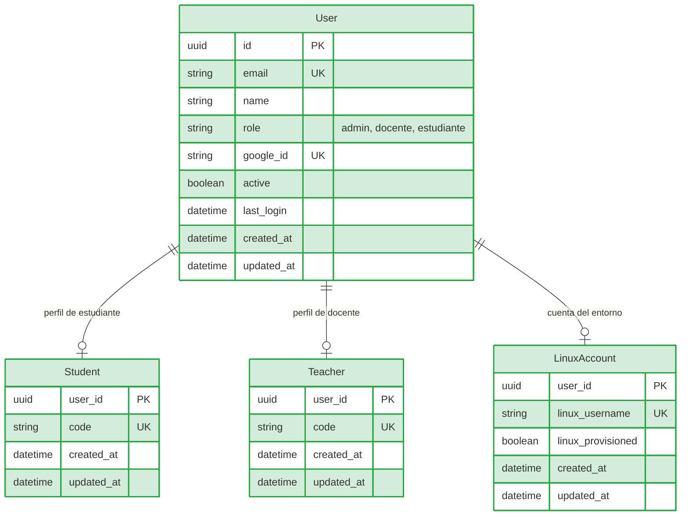

# SRS — Iteración 1: Acceso y gestión de usuarios

**Proyecto:** LinuxLab UFPS
**Iteración:** 1 de 5 · Ciclo declarado: 28 de junio – 12 de julio de 2026
**Módulo:** Acceso y control de roles / Gestión de docentes
**Versión desplegada al cierre:** v0.1 — plataforma accesible, con usuarios autenticados, roles separados y docentes administrados.
**Estado:** Especificación del ciclo (documento de desarrollo)

---

## 1. Propósito y objetivo del ciclo

La primera iteración construye la capa de acceso del laboratorio: registro de estudiantes con verificación de correo, inicio de sesión mediante cuenta institucional de Google o con correo y contraseña, restablecimiento de contraseña, y la primera superficie del actor administrador: el registro, listado, activación e inactivación de docentes. El control de acceso por rol (RF-05) se establece desde este ciclo como regla transversal: toda ruta protegida resuelve la sesión y exige el rol correspondiente antes de ejecutar cualquier operación.

Se priorizó este conjunto en primer lugar por dependencia técnica, no por importancia funcional: sin autenticación y sin roles separados, ningún caso de uso de los módulos posteriores puede probarse con los actores reales del sistema. CU04 y CU05 (registrar y listar/gestionar docentes) acompañan al actor administrador como su dominio de prueba natural: sin un docente activo en la plataforma no existe usuario alguno que ejerza el resto de funcionalidades del aplicativo.

## 2. Backlog del ciclo

| CU | RF / RNF incluidos | Prioridad | Descripción |
|----|--------------------|-----------|-------------|
| CU01 | RF-01, RF-02 | Alta | Registro del estudiante por cuenta institucional de Google y por correo con contraseña, con envío automático del correo de verificación. |
| CU02 | RF-04, RF-05, RNF-04 | Alta | Inicio de sesión dual (Google OAuth o correo/contraseña) que exige correo verificado; control de acceso por rol en middleware; sesión sobre HTTPS en cookie protegida. |
| CU03 | RF-03 | Media | Restablecimiento de contraseña mediante correo con enlace de un solo uso. |
| CU04 | RF-06, RF-07 | Alta | Registro de docentes por el administrador con correo de activación automático. |
| CU05 | RF-08, RF-09 | Alta | Listado de docentes registrados y gestión del estado de su cuenta (activación e inactivación). |

## 3. Criterios de aceptación

| CU | Criterios de aceptación |
|----|-------------------------|
| CU01 | 1. Un estudiante con cuenta institucional se registra por Google o con correo y contraseña. 2. Recibe su correo de verificación tras el registro. 3. Una cuenta con correo no verificado no puede iniciar sesión. |
| CU02 | 1. Con credenciales válidas y correo verificado el usuario accede a la plataforma. 2. Con correo sin verificar o cuenta inactiva el ingreso se rechaza. 3. Un rol no puede invocar rutas de otro rol: el servidor responde 403 y no expone datos. 4. La sesión se establece sobre HTTPS y viaja en cookie protegida (`httpOnly`, `sameSite`). |
| CU03 | 1. El usuario solicita el restablecimiento y recibe el enlace en su correo. 2. Con el enlace establece una nueva contraseña. 3. La respuesta no revela si el correo existe o no. |
| CU04 | 1. El administrador registra un docente con nombre, código y correo. 2. El docente recibe automáticamente el correo de activación. 3. Un correo de administrador no puede registrarse como docente. |
| CU05 | 1. El administrador lista los docentes registrados con búsqueda y filtro por estado. 2. El administrador activa o inactiva la cuenta de un docente. 3. Un docente inactivo no puede iniciar sesión. |

## 4. Modelo de datos de la iteración

Entidades introducidas en este ciclo: `User`, `Student`, `Teacher` y `LinuxAccount` (todas marcadas como nuevas). El modelo es acumulativo: en las siguientes iteraciones se conservan estas entidades y se añaden las demás (`Settings` en la iteración 2; `Group`, `Enrollment` y `Job` en la iteración 3; el resto del dominio académico en las iteraciones 4 y 5).

Decisiones de forma del ciclo: el correo es la identidad en el login; el rol vive en `User` (no en tablas separadas de identidad); la inactivación de una cuenta (`active = false`) es un flag lógico que preserva el historial para la auditoría posterior; `LinuxAccount` nace ya en este ciclo porque el alta de estudiante y de docente deja encolado el aprovisionamiento de su cuenta del entorno, aunque la cuenta se materializa en la iteración 2.

## 5. Decisiones técnicas del ciclo

Para resolver la autenticación sin depender de un único método de acceso se optó por credenciales duales sobre Firebase Auth: la plataforma valida el token emitido por Google y lo asocia con el usuario de la base, y en paralelo admite el flujo de correo y contraseña con verificación obligatoria. Se prefirió este esquema antes que una contraseña propia gestionada por la plataforma, que obligaría a administrar credenciales adicionales, y antes que depender solo de Google, que excluiría a los estudiantes que no pudieran entrar con su cuenta institucional; el correo con dominio `@ufps.edu.co` se exige antes del intercambio de tokens. De ahí se derivan los tres correos automáticos que sostienen la confianza del acceso (verificación de registro, restablecimiento de contraseña y activación de docente).

La sesión no se delega al navegador ni a una tabla de sesiones en base de datos, sino a un JWT firmado del lado del servidor con `JWT_SECRET` y entregado en una cookie `httpOnly`. El rol viaja dentro del token firmado, de modo que no puede manipularse desde el cliente, y las operaciones sensibles lo revalidan contra la base de datos; la inactivación de una cuenta se resuelve al leer al usuario en `/me`, respondiendo con rechazo y borrando la cookie cuando la sesión ya no corresponde a una cuenta válida. Este mismo token es el que reutilizará el canal de terminal en la siguiente iteración.

El control de acceso se concentró en un middleware que compone la autenticación con la exigencia de rol y se aplica ruta por ruta en la API, complementado en el frontend por el middleware de Next y por guardas de layout que separan los dominios de estudiante y docente, con páginas dedicadas para los accesos denegados. Se descartó comprobar el rol dentro de cada controlador por su propensión a omisiones: la autorización queda así en dos capas, de manera que ninguna ruta protegida ni vista depende de un solo punto de verificación, y la denegación responde de forma uniforme con 403 sin exponer datos.

## 6. Vistas implementadas

| Vista | Ruta | Actor | Incremento del ciclo |
|-------|------|-------|----------------------|
| Iniciar sesión | `/login` | Todos | Login dual con redirección por rol y reclamo de cuenta no verificada. |
| Verificación de correo | `/auth/verificacion` | Estudiante | Confirma la dirección con el código. |
| Restablecer contraseña | `/auth/reset-password` | Todos | Establece la nueva credencial desde el enlace del correo. |
| Acción de correo | `/auth/accion` | Todos | Consolidador de acciones de Firebase (código `oobCode`). |
| Activar cuenta docente | `/auth/setup-account` | Docente | Establece la contraseña del docente registrado por el administrador. |
| Acceso no autorizado | `/unauthorized` | Todos | 403 con mensaje y salida al dominio propio. |
| Gestión de docentes | `(protected)/admin/docentes` | Administrador | Registro con formulario, listado con búsqueda y activación/inactivación. |

## 7. Endpoints implementados

| Método | Ruta | Actor | Descripción |
|--------|------|-------|-------------|
| POST | `/api/auth/firebase` | Cualquier usuario | Login dual: valida el token de Google, da de alta al estudiante la primera vez y entrega la cookie de sesión. |
| GET | `/api/auth/me` | Cualquier usuario autenticado | Devuelve el usuario de la sesión; si la sesión ya no es válida, limpia la cookie. |
| POST | `/api/auth/logout` | Cualquier usuario autenticado | Cierra la sesión, la registra en la bitácora y borra la cookie. |
| POST | `/api/auth/request-verification` | Público | Envía el correo de verificación; respuesta genérica si el correo no existe. |
| POST | `/api/auth/request-password-reset` | Público | Envía el correo de restablecimiento; respuesta genérica si el correo no existe. |
| GET | `/api/admin/docentes` | Administrador | Listado de docentes con búsqueda y filtro de estado. |
| POST | `/api/admin/docentes` | Administrador | Registro de docente (idempotente) con correo de activación y encolado de su cuenta Linux. |
| PATCH | `/api/admin/docentes/:id` | Administrador | Activación/inactivación de la cuenta docente. |

## 8. Pruebas del ciclo

Pruebas unitarias de rutas HTTP con Jest + supertest: la base de datos se reemplaza por un mock de Prisma, la integración con Firebase/correo se mockea en la frontera, y la sesión es un JWT real firmado con el secreto de prueba, por lo que el middleware de autorización se ejercita de verdad. Comando: `npx jest tests/auth tests/admin` desde `backend/`.

| Suite | Endpoint / pieza | Casos | CU / RF |
|-------|------------------|-------|---------|
| `tests/auth/authRoutes.test.js` | `POST /api/auth/firebase` | Rechazo de petición sin token (400); alta de estudiante con cookie; rechazo de correo sin verificar (403); sin duplicar usuarios; bloqueo de cuenta inactiva (403). | CU01, CU02 |
| `tests/auth/authRoutes.test.js` | `POST /api/auth/request-verification` | Envío del correo con categoría `verification`; respuesta genérica para correo inexistente; DTO inválido (400). | CU01 |
| `tests/auth/authRoutes.test.js` | `POST /api/auth/request-password-reset` | DTO inválido (400); respuesta genérica para correo inexistente; error de Firebase (500). | CU03 |
| `tests/auth/authRoutes.test.js` | `GET /api/auth/me` | 401 sin sesión; 200 con sesión válida; 401 con firma falsa; 403 con cuenta desactivada y limpieza de cookie. | CU02 |
| `tests/auth/authRoutes.test.js` | `POST /api/auth/logout` | Cierre de sesión: confirmación, borrado de cookie y registro `auth_logout` en la bitácora. | CU02 |
| `tests/auth/roles.test.js` | `GET /api/admin/docentes` | Sesión de estudiante → 403 sin consultar la base; sesión de docente → 403 sin consultar la base. | CU02 (RF-05) |
| `tests/admin/adminDocentes.test.js` | `POST /api/admin/docentes` | Registro docente (201) con invitación por correo y encolado del aprovisionamiento de su cuenta Linux; correo de administrador no promovible (409); payload incompleto (400). | CU04 |
| `tests/admin/adminDocentes.test.js` | `GET /api/admin/docentes` | Listado con filtro de docentes (200). | CU05 |
| `tests/admin/adminDocentes.test.js` | `PATCH /api/admin/docentes/:id` | Inactivación de docente con trazabilidad en auditoría; id sin perfil docente (404). | CU05 |

**Total del ciclo: 24 pruebas unitarias en verde** (16 auth, 2 roles, 6 docentes), ejecutadas sin base de datos ni contenedores.

**Estado al cierre.** Desplegado y funcional: registro con verificación, login dual, restablecimiento de contraseña, gestión completa de docentes y separación de roles. Los eventos de auditoría ya se registran desde este ciclo (los tipos `auth_login`, `auth_logout`, `teacher_registered`, `teacher_toggled`), aunque su consulta (CU25/CU26) se incorpora en la iteración final. La cuenta Linux del usuario queda encolada (`user_provisioning`) para la iteración del entorno, que es la que sigue del módulo de práctica.
