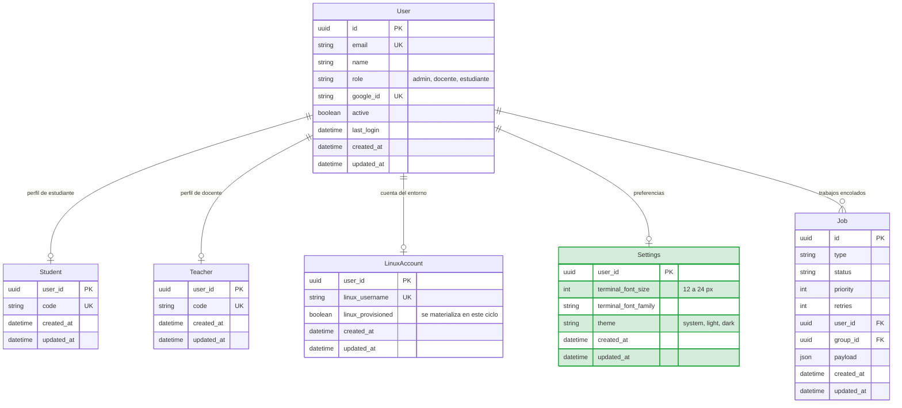
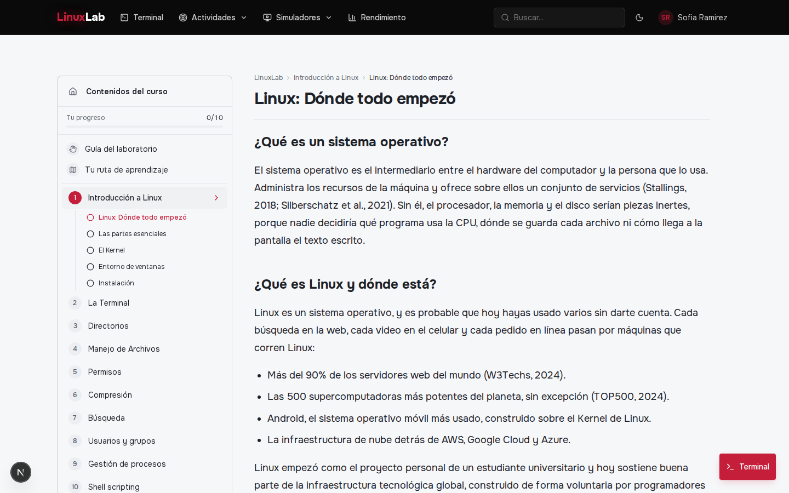
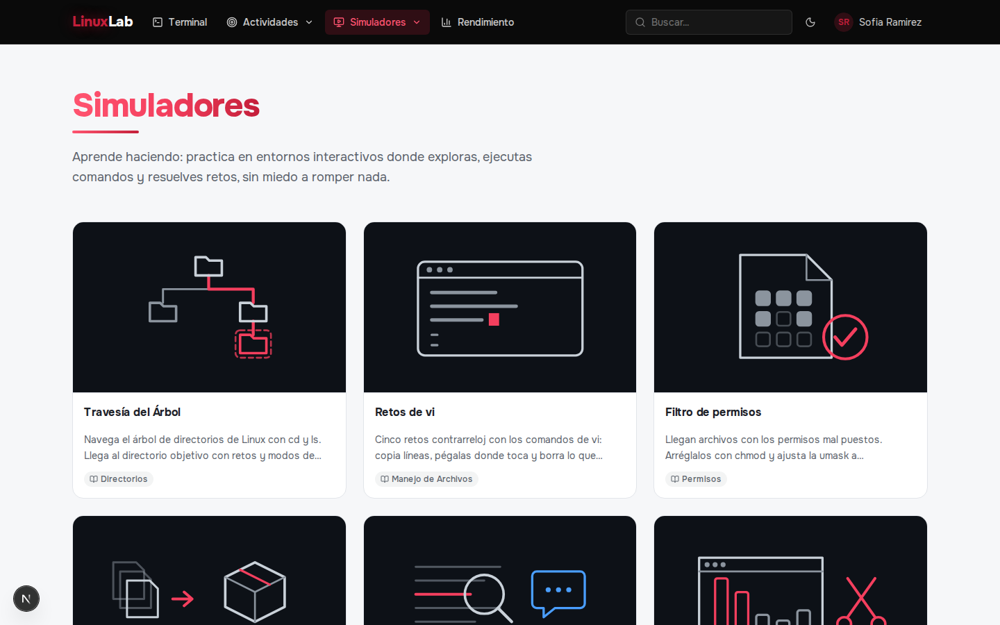
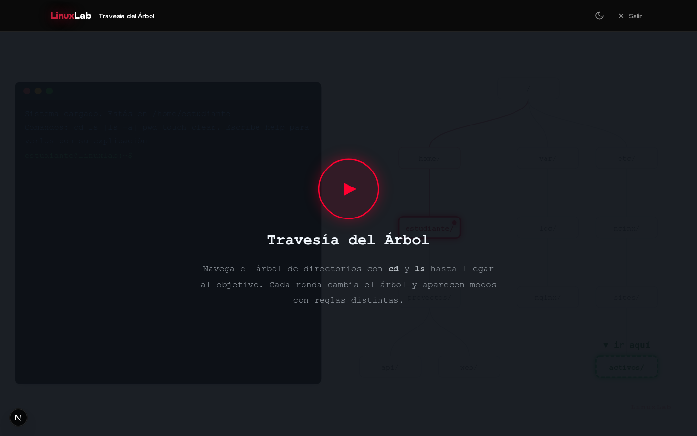
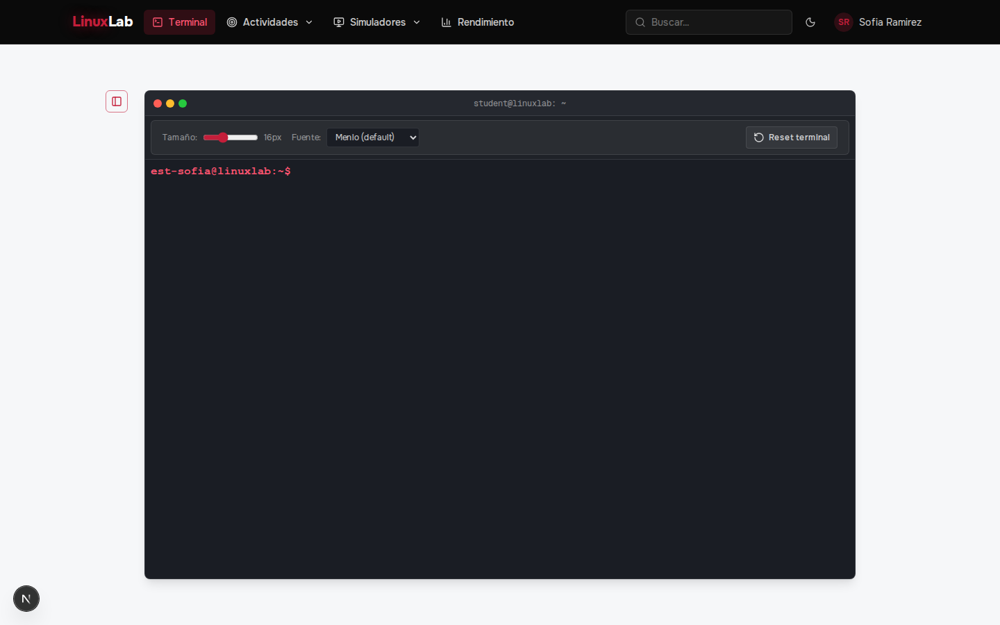

# SRS — Iteración 2: Contenido académico y entorno Linux

**Proyecto:** LinuxLab UFPS
**Fecha de ejecución:** 13 de julio – 26 de julio de 2026
**Módulo:** Contenido académico y entorno Linux / Temario, simuladores y terminal
**Versión desplegada al cierre:** v0.2 — temario navegable con recursos hipermediales y un entorno Linux integrado, con sesiones persistentes, aisladas y con límites de seguridad y recursos.

---

## 1. Análisis

### 1.1 Propósito y objetivo del ciclo

En la segunda iteración se construyó el contenido académico y el entorno de práctica del laboratorio, tomando como base la identidad y los roles ya resueltos en la iteración anterior. El estudiante navega el temario fijo del curso con sus recursos hipermediales (texto y simuladores), y dispone de una terminal Linux real accesible desde el navegador, conectada a su cuenta y a su directorio `/home` personales dentro de un contenedor compartido. El ciclo cierra cuando el entorno queda materializado: la cuenta Linux que en la iteración 1 solo se encolaba ahora existe en el sistema, la sesión de terminal se abre sobre una PTY real, la cuenta queda aislada y limitada en recursos, y el servidor impide el uso de privilegios de superusuario. Se prioriza este módulo por dependencia técnica, pues sin temario y sin entorno no puede resolverse ninguna de las actividades prácticas de los ciclos posteriores.

### 1.2 Backlog del ciclo

| CU | RF / RNF incluidos | Prioridad | Descripción |
|----|--------------------|-----------|-------------|
| CU11 | RF-15, RNF-01 | Alta | Navegación del temario fijo por el estudiante y consulta de sus recursos hipermediales (texto, video y enlaces), accesible desde los navegadores web modernos. |
| CU12 | RF-16 | Media | Uso de los simuladores interactivos asociados a los temas del temario. |
| CU14 | RF-18, RF-19, RNF-02, RNF-03, RNF-06, RNF-07, RNF-08 | Alta | Terminal Linux real en el navegador sobre la cuenta y el directorio personal del estudiante: sesión persistente, aislada, sin privilegios de superusuario, con límites de recursos, cierre por inactividad y despliegue on-premise; incluye las preferencias de tipografía y tema de la terminal (RF-19). |

### 1.3 Criterios de aceptación

| CU | Criterios de aceptación |
|----|-------------------------|
| CU11 | 1. El estudiante navega el temario por temas y subtemas y consulta los recursos hipermediales de cada uno. 2. El temario es accesible desde cualquier navegador web moderno sin instalar software (RNF-01). |
| CU12 | 1. El estudiante abre los simuladores asociados al temario y estos operan sin depender de estado en el servidor. |
| CU14 | 1. El usuario autenticado con cuenta provisionada abre una terminal real conectada a su entorno. 2. La conexión se rechaza sin sesión válida o con la cuenta sin provisionar. 3. El shell corre como el usuario del sistema asignado, sin privilegios de superusuario. 4. Cada cuenta opera aislada con límites de CPU, memoria, inodos y disco. 5. Tras cerrar y reabrir, el directorio personal conserva archivos y configuraciones. 6. La sesión inactiva se cierra y libera la PTY. |

## 2. Diseño

### 2.1 Modelo de datos de la iteración

Entidad introducida en este ciclo: `Settings` (marcada como nueva). Se conservan las entidades de la iteración anterior (`User`, `Student`, `Teacher`, `LinuxAccount` y `Job`) y se materializa la cuenta Linux, que pasa de `linux_provisioned = false` a `true` cuando el worker termina de crearla en el entorno.

Decisión de forma del ciclo: las preferencias del entorno viven en `Settings`, una extensión uno a uno de `User`, en lugar de columnas nuevas en `User` o de almacenamiento en el navegador, de modo que viajan con la cuenta del usuario y se comparten entre dispositivos. El avance del temario no forma parte de este modelo: la matrícula y su registro (`Enrollment`, `TopicProgress` y `LessonView`) se introducen en la iteración 3, de la que depende el avance de lectura.

### 2.2 Decisiones técnicas del ciclo

El contenido del temario se mantiene como archivos versionados en el repositorio en lugar de datos administrables en base de datos: es un temario fijo, igual para todos los grupos, y su autoría se resuelve por control de versiones. El indicador de avance que el temario muestra al estudiante se persiste sobre la capa de matrícula que introduce la iteración 3.

La terminal se resolvió con una PTY real sobre SSH al contenedor, en lugar de un emulador en el navegador, porque la asignatura exige comandos reales del sistema operativo. El canal es un WebSocket en la ruta `/terminal` que reutiliza la misma cookie httpOnly de la sesión HTTP para autenticarse, de manera que no se abre un segundo mecanismo de credenciales ni se expone el token al cliente. Antes de abrir la PTY, el gateway verifica que el usuario exista y que su cuenta Linux esté provisionada; cualquier fallo cierra el socket con un código de la familia 4001 sin filtrar el detalle interno. El control de acceso por curso (matrícula activa) se incorpora en la iteración 3, cuando existe la matrícula.

El aislamiento y los límites se aplican en el sistema operativo y no en la aplicación: cada estudiante opera bajo su propia cuenta de usuario del sistema, con `cgroups` (CPU al 10 % y techos de memoria por proceso) y cuotas de disco e inodos. La sesión arranca con `nice -n 10 su - <usuario>`, es decir, con el shell del estudiante sin privilegios de superusuario, y los comandos administrativos del provisionamiento corren del lado del servidor como `labadmin`, nunca desde la sesión del estudiante. El home es persistente entre sesiones: conserva los archivos y las configuraciones del usuario al cerrar y reabrir la terminal.

El aprovisionamiento de la cuenta se mantiene desacoplado del alta con una cola de trabajos y un worker que procesa lotes cada 5 segundos: el alta del usuario encola el `Job` y la terminal espera a que `linux_provisioned` sea verdadero. El cierre por inactividad se resuelve con un heartbeat de ping/pong cada 30 segundos que termina los sockets que no responden, liberando la PTY y los procesos asociados sin afectar la persistencia de los archivos.

## 3. Codificación

### 3.1 Vistas implementadas

| Vista | Ruta | Actor | Incremento del ciclo |
|-------|------|-------|----------------------|
| Portada del curso | `/inicio` | Estudiante, docente, administrador | Panel de bienvenida del curso con acceso al temario y a las actividades según el rol. |
| Temario y lección | `/curso` | Estudiante, docente, administrador | Navegación del temario por temas y subtemas, con recursos hipermediales (texto, video y enlaces). |
| Simuladores | `/simuladores`, `/simuladores/[id]` | Estudiante, docente, administrador | Simuladores interactivos asociados a los temas, operados en el cliente. |
| Terminal Linux | `/terminal` | Estudiante, docente, administrador | Terminal real en el navegador sobre la PTY del entorno, con panel de preferencias de tipografía y tema. |

Registro visual de las vistas del ciclo (capturas tomadas sobre el entorno local con datos de demostración):

### 3.2 Endpoints implementados

| Método | Ruta | Actor | Descripción |
|--------|------|-------|-------------|
| WS | `/terminal` | Usuario autenticado con cuenta provisionada | Abre la PTY del entorno; reenvía `input` y `resize` y atiende `reset`. |
| POST | `/api/terminal/reset` | Usuario con cuenta provisionada | Mata los procesos del usuario para reiniciar la sesión de terminal. |
| PUT | `/api/preferences` | Usuario autenticado | Actualiza las preferencias del entorno (tema, tamaño y familia tipográfica). |

## 4. Pruebas

### 4.1 Pruebas del ciclo

Pruebas unitarias y de integración con Jest: las rutas HTTP se ejercitan con supertest sobre un mock del cliente Prisma, la sesión es un JWT real firmado con el secreto de prueba (por lo que la autenticación se prueba de verdad), y el entorno se sustituye en la frontera por un mock de SSH. La terminal WebSocket se prueba levantando un servidor HTTP efímero con un cliente `ws` real, mockeando la apertura de la PTY y la base de datos. Comando: `npm run test:it2` desde `backend/`.

| CU / RF / RNF | Endpoint / pieza | Casos |
|---------------|------------------|-------|
| CU14, RF-18 | `WS /terminal` | Cierre 4001 sin cookie, sin cuenta Linux y con cuenta sin provisionar; apertura de PTY y reenvío de `input`/`resize`; `reset` que mata procesos y recrea la PTY; cierre 1008 por inundación; cierre 1009 por payload sobredimensionado. |
| CU14, RF-18 | `wsAuth` | Rechazo sin cookie; rechazo con firma inválida; aceptación con cookie válida; hallazgo de la cookie entre otras. |
| CU14, RF-18 | `POST /api/terminal/reset` | 401 sin sesión; 400 sin cuenta Linux; 200 con cuenta válida. |
| CU14, RF-19 / RNF-03, RNF-07 | `containerService` | Cuota de disco e inodos y techos de cgroup; PTY con `nice` y `su` sin sudo; marcado de `linux_provisioned` solo tras verificar el home; fallo si el home es ajeno. |
| CU14, RNF-07 | `containerService.resetTerminal` | Mata los procesos del usuario; rechaza un nombre de cuenta con caracteres inyectables. |
| CU14, RNF-08 | `heartbeat` | Termina a los clientes que no responden al ping; termina en el siguiente ciclo al que dejó de responder; `stopHeartbeat` detiene el latido. |
| CU14, RF-19 | `PUT /api/preferences` | 401 sin sesión; 400 por tamaño de letra fuera de rango (11 y 25); 400 por tema inválido; 400 por familia tipográfica inválida; 200 aplicando solo los campos enviados; 200 sin campos en el cuerpo. |

Total de la iteración: 30 pruebas en verde, repartidas en 6 suites (7 preferencias, 3 terminal HTTP, 6 terminal-entorno, 3 heartbeat, 4 wsAuth, 7 gateway WebSocket). La suite completa del proyecto queda en 66 pruebas verdes, sumando las 21 de la iteración 1 y las 15 que la iteración 3 aporta del avance del temario, la gestión de docentes y el acceso de la terminal por matrícula.
