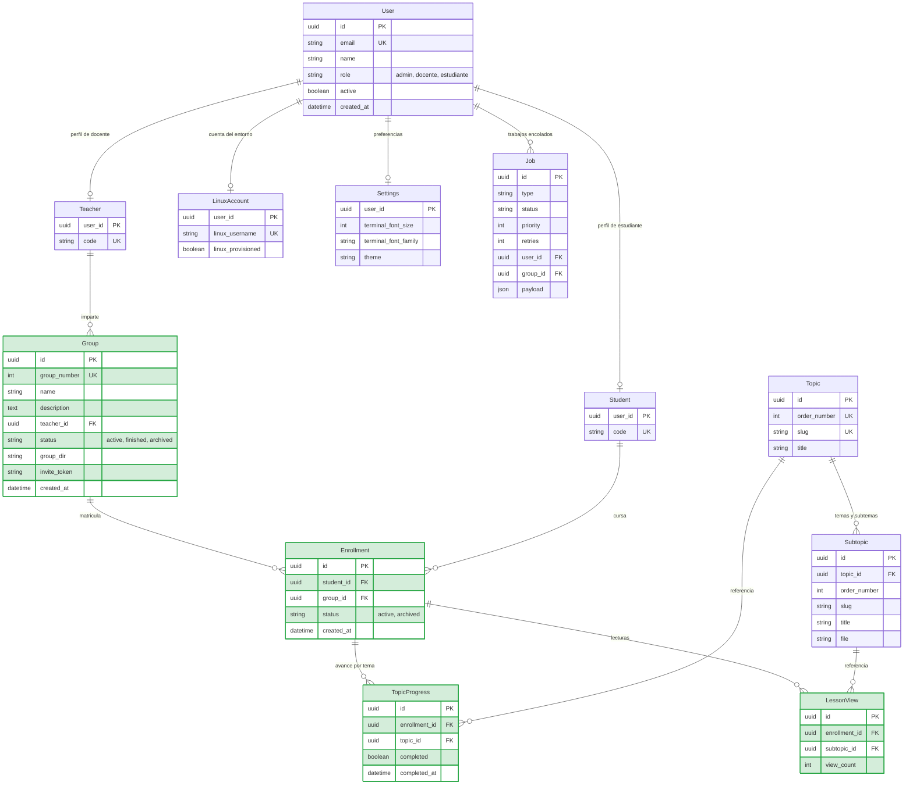
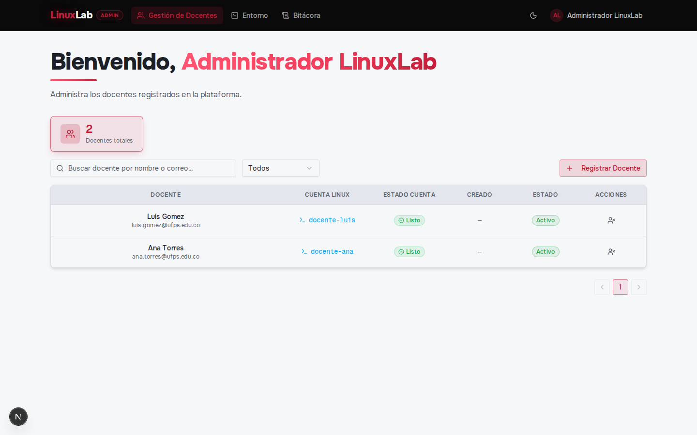
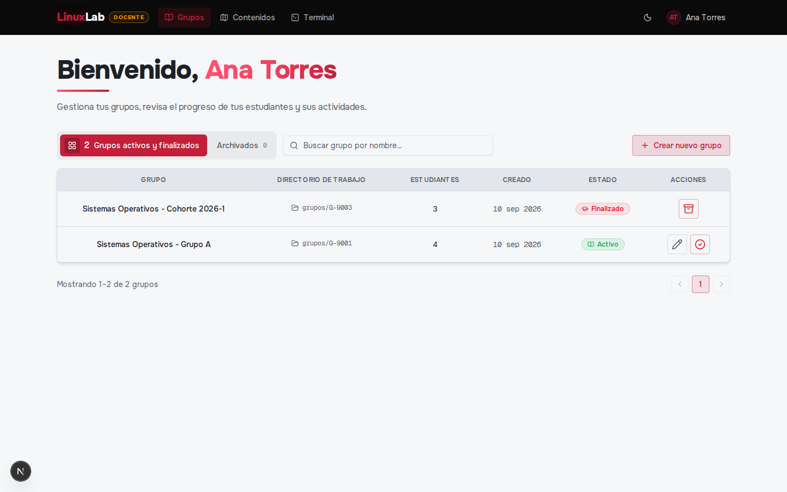
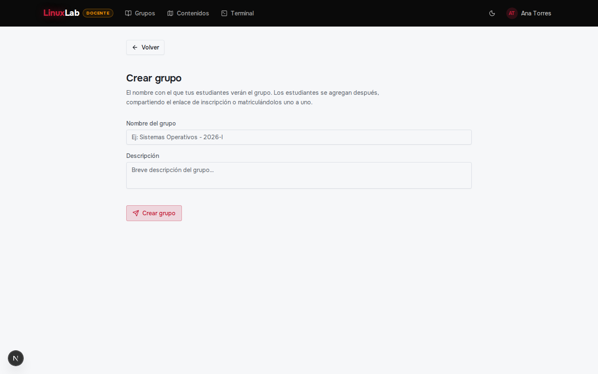
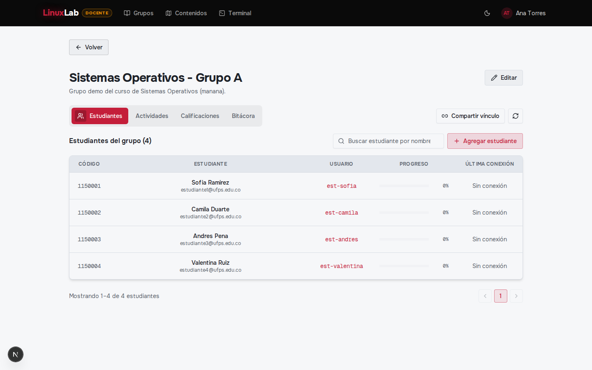
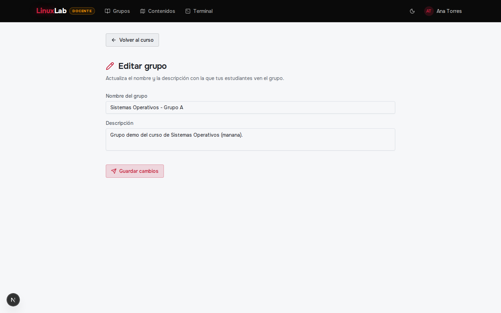
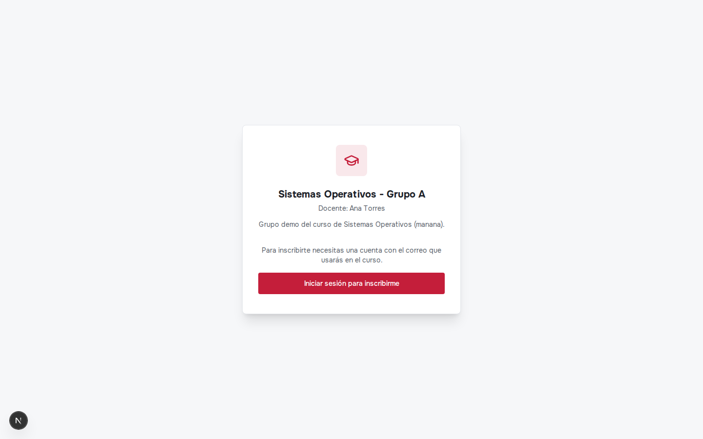
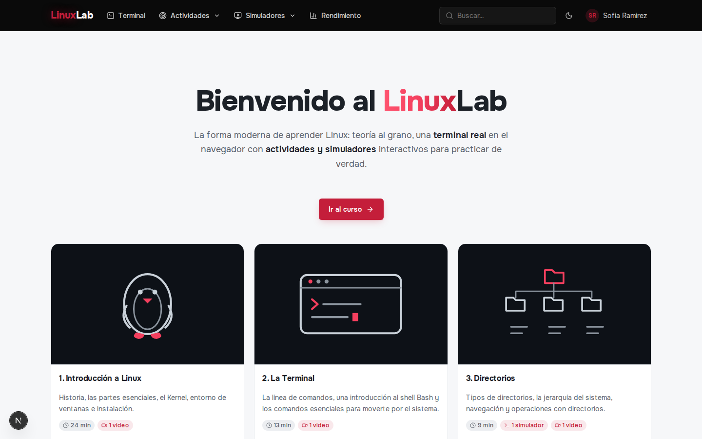

# SRS — Iteración 3: Gestión docente y grupos de laboratorio

**Proyecto:** LinuxLab UFPS
**Fecha de ejecución:** 27 de julio – 9 de agosto de 2026
**Módulo:** Gestión docente y grupos de laboratorio / Matrícula y avance
**Versión desplegada al cierre:** v0.3 — docentes administrados, grupos creados y editados por el docente, estudiantes vinculados por enlace o matrícula y su entorno Linux asociado, con el avance del temario registrado por matrícula.

---

## 1. Análisis

### 1.1 Propósito y objetivo del ciclo

En la tercera iteración se construyó la organización académica del laboratorio: el administrador lista y activa o inactiva docentes, y el docente crea, edita y archiva sus grupos de laboratorio, comparte un enlace de invitación para la auto-inscripción y vincula estudiantes de forma individual o por carga CSV. Cada matrícula encola el aprovisionamiento de la cuenta del estudiante dentro del grupo Unix del curso, y el entorno se desmonta cuando el grupo se archiva o se elimina.

El ciclo cierra además dos alcances que la iteración anterior dejó fuera por depender de la matrícula: el **registro del avance de lectura** del temario (extensión de CU11) y el **control de acceso a la terminal por matrícula**, con la cuenta del estudiante creada dentro del grupo Unix del curso y destruida con él (extensión de CU14). Se prioriza este módulo por dependencia técnica, pues sin grupos y matrícula no puede asignarse ninguna actividad ni medirse el progreso de un curso.

### 1.2 Backlog del ciclo

| CU | RF / RNF incluidos | Prioridad | Descripción |
|----|--------------------|-----------|-------------|
| CU05 | RF-08, RF-09 | Alta | Listado de docentes y gestión de su estado (activación e inactivación). |
| CU06 | RF-10 | Alta | Creación del grupo de laboratorio por el docente, con estudiantes iniciales opcionales. |
| CU07 | RF-11 | Media | Edición del nombre y la descripción de un grupo activo. |
| CU08 | RF-12 | Alta | Archivado (y desarchivado) del grupo, con desmontaje del entorno, y eliminación de un grupo archivado. |
| CU09 | RF-13 | Alta | Generación y renovación del enlace de invitación del grupo. |
| CU10 | RF-14 | Alta | Vinculación de estudiantes por correo o código, individual y por carga CSV, con encolado del aprovisionamiento; auto-inscripción mediante el enlace del grupo. |
| CU11 (extensión) | RF-15 | Alta | Registro del avance de lectura del temario y consulta del progreso, sobre la matrícula activa del estudiante. |
| CU14 (extensión) | RF-18, RNF-03, RNF-07 | Alta | Acceso a la terminal condicionado a la matrícula activa; la cuenta del estudiante se crea dentro del grupo Unix del curso y se destruye con el grupo. |

### 1.3 Criterios de aceptación

| CU | Criterios de aceptación |
|----|-------------------------|
| CU05 | 1. El administrador lista los docentes con búsqueda y filtro por estado. 2. Activa o inactiva la cuenta de un docente. 3. Un id sin perfil docente se rechaza. |
| CU06 | 1. El docente crea un grupo con nombre y descripción cuando su cuenta Linux está provisionada. 2. El aprovisionamiento del grupo se encola al crearlo. 3. Sin cuenta provisionada la creación se rechaza; un estudiante no puede crear grupos. |
| CU07 | 1. El docente edita el nombre y la descripción de un grupo activo. 2. Un grupo finalizado o archivado no es editable. |
| CU08 | 1. El docente archiva un grupo y su entorno se desmonta, conservando el histórico. 2. Un grupo archivado se puede desarchivar. 3. Solo un grupo archivado se puede eliminar, y al hacerlo se libera a sus estudiantes. |
| CU09 | 1. El docente obtiene un enlace de invitación para su grupo. 2. Puede renovarlo para invalidar el anterior. |
| CU10 | 1. El docente vincula un estudiante por correo o código y el aprovisionamiento de su cuenta se encola. 2. La carga CSV matricula por lotes e informa los errores por fila. 3. Un estudiante con el enlace vigente se inscribe por sí mismo. 4. Un token inválido o un grupo inactivo se rechazan; un docente no puede inscribirse como estudiante. |
| CU11 (extensión) | 1. Al abrir una lección queda registrada su lectura en todas las matrículas activas del estudiante. 2. El progreso del tema se actualiza cuando todos sus subtemas están leídos. 3. Un estudiante sin matrícula activa no acumula avance y el servidor lo rechaza con 409. |
| CU14 (extensión) | 1. La sesión de terminal se rechaza si el estudiante no tiene matrícula activa. 2. La cuenta del estudiante se crea dentro del grupo Unix del curso. 3. Al archivar o finalizar el grupo se desmonta la cuenta y el directorio del curso. |

## 2. Diseño

### 2.1 Modelo de datos de la iteración

Entidades introducidas en este ciclo: `Group`, `Enrollment`, `TopicProgress` y `LessonView` (marcadas como nuevas). Se conservan las entidades de los ciclos anteriores (`User`, `Student`, `Teacher`, `LinuxAccount`, `Job`, `Settings`, `Topic` y `Subtopic`).

Decisiones de forma del ciclo: la matrícula (`Enrollment`) es la unidad que ata a un estudiante con un grupo y el eje de todo lo académico; un estudiante cursa un solo grupo activo a la vez. El avance (`TopicProgress`, `LessonView`) cuelga de la matrícula y no del usuario, de modo que leer una lección cuenta en cada curso en el que el estudiante esté inscrito y se conserva por cohorte. El grupo guarda su `status` y su `group_dir` como estado del ciclo de vida, y el `invite_token` es el único secreto de la auto-inscripción.

### 2.2 Decisiones técnicas del ciclo

La organización académica se apoyó en una cola de trabajos desacoplada del alta: crear un grupo, matricular a un estudiante o desmontar un curso no bloquean la petición, sino que registran un `Job` que un worker procesa por lotes cada 5 segundos, con prioridades por tipo (docente, grupo, estudiante), reintentos con tope y reclamo de lotes con `FOR UPDATE SKIP LOCKED` para que varias instancias no repitan trabajo. El mismo mecanismo es el que repara el entorno: la reconciliación reconstruye desde la base de datos las cuentas y directorios que falten, siguiendo el orden jerárquico docente → grupo → estudiante, de modo que una pérdida de volumen o contenedor no deje cuentas huérfanas.

El enlace de invitación es un token opaco por grupo que se puede renovar, y la auto-inscripción pasa por el mismo camino que la matrícula manual: valida que el grupo esté activo, que el token coincida y que quien se inscribe sea estudiante; al inscribirse, el servidor reemite la cookie de sesión para que el nuevo estado de matrícula (`hasEnrollment`) se refleje de inmediato sin obligar a un nuevo inicio de sesión. La matrícula manual admite una fila o una carga CSV; en ambos casos el proceso es idempotente (reinscribir no duplica) y los errores de una fila no tumban el lote. Como un estudiante solo puede estar en un grupo activo, la matrícula se rechaza si ya cursa otro.

El archivado cierra el curso sin perder el histórico: dentro de una transacción marca el grupo y sus matrículas, cancela los trabajos de aprovisionamiento pendientes que recrearían lo que se está por destruir y encola el desmontaje del entorno, que elimina la cuenta, el grupo Unix y el directorio del curso. El `Job` conserva los nombres de usuario porque las filas que los contenían se borran en la misma operación. Solo un grupo archivado se puede eliminar, y el borrado vuelve a desmontar por si el primer teardown falló, liberando a los estudiantes para matricularse en otro curso.

El avance de lectura se resuelve sobre la matrícula y no sobre el temario: al abrir un subtema se registra la lectura en todas las matrículas activas del estudiante, y el progreso del tema se marca cuando todos sus subtemas fueron leídos. Esto mantiene el temario como contenido fijo y versionado, y hace que el indicador de avance sea por curso y no global.

## 3. Codificación

### 3.1 Vistas implementadas

| Vista | Ruta | Actor | Incremento del ciclo |
|-------|------|-------|----------------------|
| Gestión de docentes | `/admin/docentes` | Administrador | Listado con búsqueda y filtro de estado, y activación/inactivación (misma vista del registro de docente). |
| Panel de grupos | `/inicio` | Docente | Listado de grupos activos y finalizados, con creación y acceso al detalle. |
| Crear grupo | `/grupos/crear` | Docente | Formulario de nombre, descripción y estudiantes iniciales. |
| Detalle de grupo | `/grupos/[id]` | Docente | Estudiantes matriculados, enlace de invitación y seguimiento del curso. |
| Editar grupo | `/grupos/[id]/editar` | Docente | Edición de nombre y descripción de un grupo activo. |
| Mi grupo | `/estudiante/grupo` | Estudiante | Grupo activo del estudiante, matrícula y progreso. |
| Inscripción por enlace | `/inscripcion` | Estudiante | Auto-inscripción con el token del grupo. |
| Inscripción pendiente | `/inscripcion/pendiente` | Estudiante | Estado para el estudiante autenticado sin matrícula activa. |

Registro visual de las vistas del ciclo (capturas tomadas sobre el entorno local con datos de demostración):

### 3.2 Endpoints implementados

| Método | Ruta | Actor | Descripción |
|--------|------|-------|-------------|
| GET | `/api/admin/docentes` | Administrador | Listado de docentes con búsqueda y filtro de estado. |
| PATCH | `/api/admin/docentes/:id` | Administrador | Activación/inactivación de la cuenta docente. |
| POST | `/api/groups` | Docente | Crea el grupo y encola su aprovisionamiento. |
| GET | `/api/groups` | Docente | Lista los grupos del docente (todos, si es administrador). |
| GET | `/api/groups/:id` | Docente | Detalle del grupo con conteos y promedio. |
| PATCH | `/api/groups/:id` | Docente | Edita nombre y descripción de un grupo activo. |
| PATCH | `/api/groups/:id/archive` | Docente | Archiva el grupo y encola el desmontaje del entorno. |
| POST | `/api/groups/:id/unarchive` | Docente | Devuelve un grupo archivado al listado. |
| DELETE | `/api/groups/:id` | Docente | Elimina un grupo archivado y libera a sus estudiantes. |
| POST | `/api/groups/:id/invite/rotate` | Docente | Genera un enlace de invitación nuevo. |
| POST | `/api/groups/:id/students` | Docente | Vincula un estudiante individual y encola su aprovisionamiento. |
| POST | `/api/groups/:id/students/csv` | Docente | Matricula por lotes desde CSV e informa errores por fila. |
| GET | `/api/groups/:id/students` | Docente | Lista los estudiantes matriculados. |
| GET | `/api/enroll/group/:id/info` | Público | Información del grupo para la pantalla de inscripción. |
| POST | `/api/enroll/group/:id` | Estudiante | Auto-inscripción con el token del grupo. |
| GET | `/api/groups/provisioning/status` | Docente | Resumen de aprovisionamiento de sus grupos. |
| GET | `/api/groups/:id/provisioning-jobs` | Docente | Trabajos de aprovisionamiento de los estudiantes del grupo. |
| POST | `/api/groups/:id/reconcile` | Docente | Reencola el entorno faltante del grupo. |
| GET | `/api/progress` | Estudiante | Avance del temario y actividades del grupo. |
| POST | `/api/lessons/:topicSlug/:subtopicId/view` | Estudiante | Registra la lectura de un subtema; 409 sin matrícula. |

## 4. Pruebas

### 4.1 Pruebas del ciclo

Pruebas de rutas HTTP con Jest + supertest sobre un mock del cliente Prisma y la sesión como JWT real; los colaboradores pesados (provisión/SSH, correo) se sustituyen en la frontera y la terminal WebSocket se prueba con un cliente `ws` real. Comando: `npm run test:it3` desde `backend/`.

| CU / RF / RNF | Endpoint / pieza | Casos |
|---------------|------------------|-------|
| CU05, RF-08, RF-09 | `GET/PATCH /api/admin/docentes` | Listado con filtro (200); inactivación con trazabilidad; id sin perfil docente (404). |
| CU06, RF-10 | `POST/GET /api/groups` | Estudiante no crea (403); sin nombre (400); cuenta del docente sin provisionar (409); creación (201) con `group_provisioning` encolado; listado con conteos (200). |
| CU07, RF-11 | `GET/PATCH /api/groups/:id` | Edición de grupo activo (200); grupo no activo (409); id inválido (404). |
| CU08, RF-12 | `PATCH /archive`, `DELETE /:id` | Archivado con `group_teardown` encolado (200); borrado de grupo no archivado (409); borrado de archivado con desmontaje (204). |
| CU09, RF-13 | `POST /:id/invite/rotate` | Enlace de invitación nuevo (200). |
| CU10, RF-14 | `GET /api/enroll/group/:id/info` | Info con token válido (200); token inválido (403); grupo inactivo (404). |
| CU10, RF-14 | `POST /api/enroll/group/:id` | Sin sesión (401); token inválido (403); auto-inscripción (200) con aprovisionamiento y cookie refrescada. |
| CU10, RF-14 | `/api/groups/:id/students` | Vinculación individual (201) con correo y `user_provisioning`; listado (200); CSV vacío (400). |
| CU11 (ext), RF-15 | `/api/progress`, `/api/lessons/:topicSlug/:subtopicId/view` | 401 sin sesión; 404 subtema inexistente o de otro tema; 409 sin matrícula; registro en todas las matrículas (204); estado vacío y con matrícula. |
| CU14 (ext), RF-18, RNF-03, RNF-07 | `containerService`, `WS /terminal` | Alta del estudiante en el grupo Unix y aborto si falta; terminal con matrícula (apertura) y rechazo 4001 sin ella; reinicio 403 sin matrícula. |

Total de la iteración: 36 pruebas en verde (3 de CU05, 12 de grupos, 9 de matrícula, 8 de avance y 4 del alcance por curso de la terminal). La suite completa del proyecto queda en 87 pruebas verdes, sumando las 21 de la iteración 1 y las 30 de la iteración 2.
