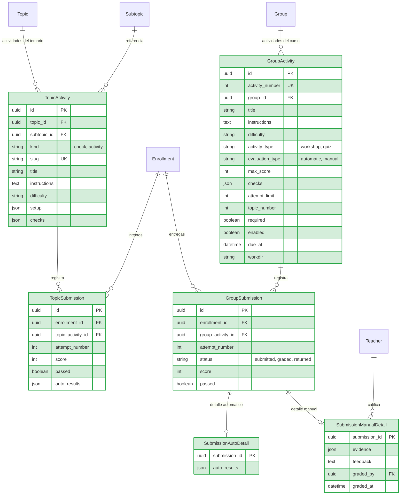
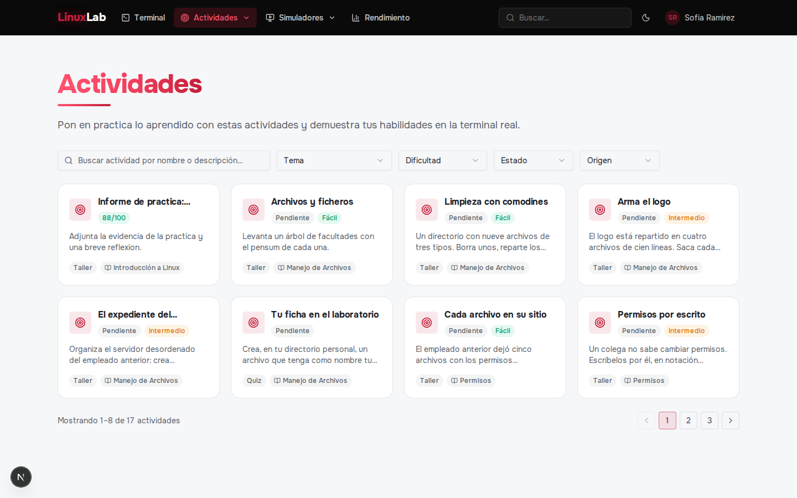
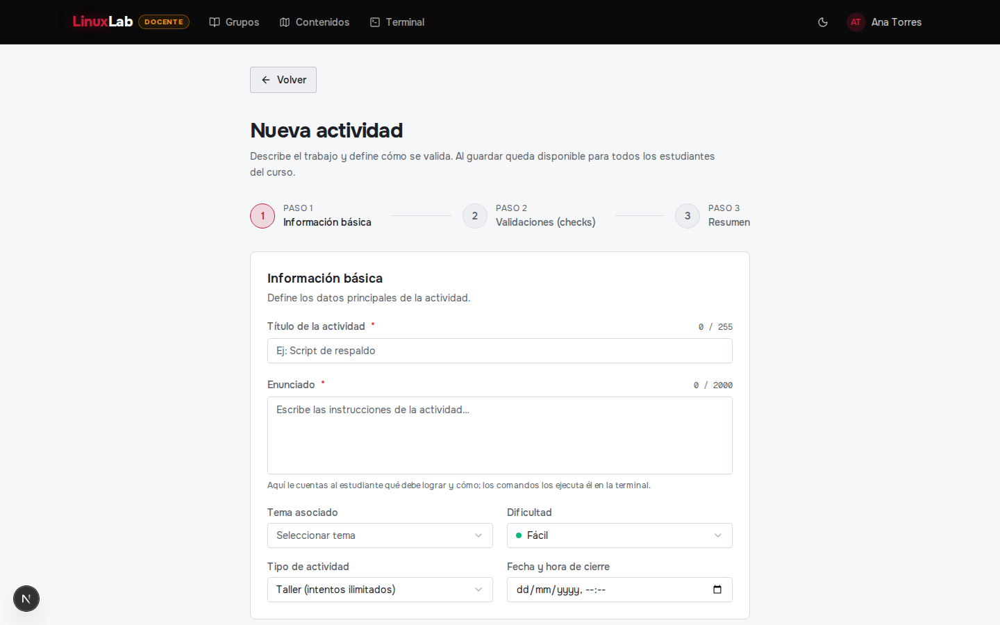
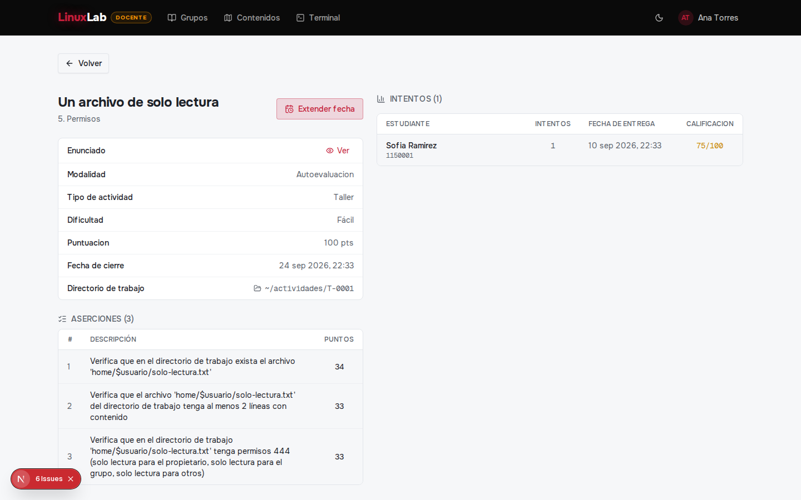
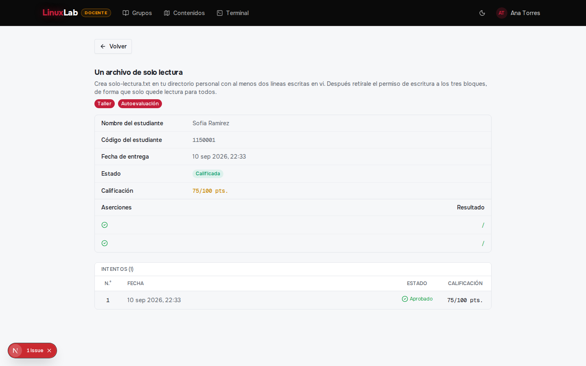
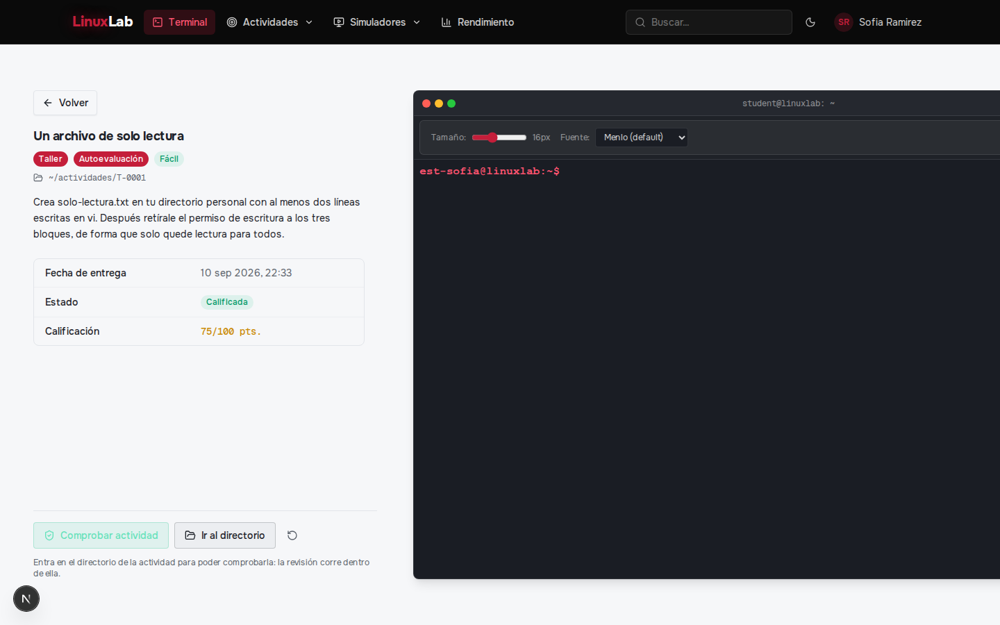
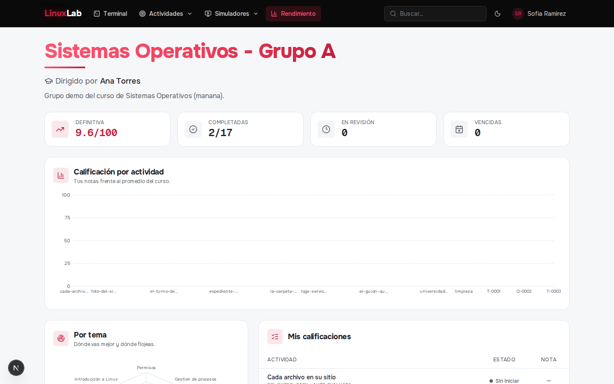

# Backlog Iteración 4: Actividades y evaluación

**Fecha de ejecución:** 10 de agosto – 23 de agosto de 2026
**Módulo:** Actividades y evaluación

---

## 1. Análisis

### 1.1 Propósito y objetivo del ciclo

En la cuarta iteración se construyó el núcleo académico del laboratorio. El docente crea actividades propias de su grupo y publica las del banco del temario, configurando sus aserciones de evaluación automática o marcándolas de revisión manual, con límite de intentos, dificultad y fecha de cierre. El estudiante resuelve esas actividades sobre el entorno real de su cuenta, recibe retroalimentación automática por cada aserción o entrega la evidencia para revisión manual, y consulta el estado y la calificación de cada una. El docente califica las entregas manuales con retroalimentación escrita y consulta los envíos de su grupo. Se prioriza este módulo por dependencia técnica, pues sin actividades evaluables el curso no produce calificación ni permite el cierre con certificación de la iteración siguiente.

### 1.2 Backlog del ciclo

| CU | RF / RNF incluidos | Prioridad | Descripción |
|----|--------------------|-----------|-------------|
| CU13 | RF-17 | Alta | Resolución de las actividades del temario y sus reintentos, con resultados por aserción. |
| CU15 | RF-20, RF-21 | Alta | Creación de actividades personalizadas por el docente y configuración de sus aserciones del catálogo. |
| CU16 | RF-22, RF-23 | Alta | Habilitación/deshabilitación de actividades y extensión de su fecha de cierre. |
| CU17 | RF-24, RF-25, RF-29 | Alta | Resolución de actividades automáticas: taller con intentos ilimitados y quiz con tope del docente, mostrando el resultado por aserción. |
| CU18 | RF-26 | Alta | Entrega de una actividad de revisión manual dentro de la fecha de cierre. |
| CU19 | RF-27 | Alta | Calificación de entregas manuales con retroalimentación escrita. |
| CU20 | RF-28 | Alta | Consulta del estado y la calificación del estudiante en cada actividad. |

### 1.3 Criterios de aceptación

| CU | Criterios de aceptación |
|----|-------------------------|
| CU13 | 1. El estudiante resuelve las actividades del temario y puede reintentarlas. 2. Cada intento devuelve el resultado por aserción con su puntaje. 3. El avance del temario reconoce las actividades aprobadas. |
| CU15 | 1. El docente crea una actividad con título, tipo (taller o quiz), dificultad y modalidad automática o manual. 2. Una actividad automática exige al menos una aserción válida del catálogo y su puntaje no supera 100. 3. Una actividad manual no requiere aserciones. 4. Una actividad con intentos o entregas no se puede editar. |
| CU16 | 1. El docente habilita y deshabilita una actividad mientras no tenga entregas. 2. Puede extender la fecha de cierre a una fecha futura posterior a la actual. |
| CU17 | 1. Un taller admite intentos ilimitados mientras esté habilitado; un quiz respeta el tope definido por el docente. 2. Cada intento registra su resultado y calificación. 3. El estudiante reinicia los archivos de la actividad cuando lo requiera. |
| CU18 | 1. El estudiante entrega una actividad de revisión manual dentro de la fecha de cierre y su entrega queda registrada. |
| CU19 | 1. El docente califica una entrega manual entre 0 y 100 con retroalimentación escrita. 2. Solo el docente del grupo puede calificarla. |
| CU20 | 1. El estudiante consulta el estado (pendiente, enviada, calificada) y la calificación de cada actividad. |

## 2. Diseño

### 2.1 Modelo de datos de la iteración

En esta iteración se introducen las entidades de la evaluación. Las actividades del banco del temario viven en `TopicActivity`, con sus aserciones en `checks`, y cada intento del estudiante queda en `TopicSubmission`, ligado a su matrícula. Las actividades propias del docente viven en `GroupActivity`, con su tipo (taller o quiz), su modalidad, su directorio de trabajo y su fecha de cierre, y sus entregas en `GroupSubmission`. El detalle de cada entrega de grupo se guarda en `SubmissionAutoDetail` (resultado por aserción de una actividad automática) o en `SubmissionManualDetail` (evidencia, retroalimentación y docente que calificó). Se conservan las entidades de los ciclos anteriores y la matrícula sigue siendo el eje: tanto el intento del temario como la entrega de grupo cuelgan de `Enrollment`, de modo que la calificación es por curso.

### 2.2 Decisiones técnicas del ciclo

La decisión central es que el verificador de las actividades automáticas corre **como el estudiante y dentro de su entorno**, no como el servidor: la evaluación hace SSH al contenedor, personaliza un script de comprobación con la identidad del estudiante y ejecuta cada aserción contra los archivos de su directorio de trabajo. Así el resultado refleja lo que el estudiante realmente produjo, y ninguna evaluación puede leer ni modificar el entorno de otro. Por la misma razón, los parámetros que el docente escribe en una aserción (una ruta, un modo octal, una línea esperada) se tratan como **datos, no como comandos**: el catálogo de aserciones atómicas valida y normaliza cada parámetro antes de construirlos, de modo que el docente configura qué comprobar sin poder inyectar comandos en la sesión del estudiante.

Cada actividad tiene un **directorio de trabajo propio y anclado al home del estudiante**, y el estudiante puede reiniciar sus archivos sin perder el resto de su espacio. La resolución de una actividad automática sigue las reglas del tipo: el taller permite intentos ilimitados mientras esté habilitado, el quiz respeta el tope que definió el docente, y cada intento se registra con su resultado por aserción y su puntaje. La calificación definitiva de una actividad toma el último intento válido, y el estado de la actividad (habilitada, con o sin intentos) condiciona lo que el docente puede editar: una actividad con entregas queda congelada y no se puede editar ni deshabilitar.

La evaluación manual se resuelve como una entrega: el estudiante somete la evidencia antes de la fecha de cierre y el docente del grupo la califica entre 0 y 100 con retroalimentación escrita, quedando registrado quién calificó y cuándo. El detalle de cada entrega se guarda aparte del intento automático, de modo que una misma actividad puede tener resultados por aserción o evidencia y retroalimentación, y el estudiante consulta en un único lugar el estado y la calificación de todas sus actividades. Todas las acciones de creación, cambio de estado, entrega y calificación quedan en la bitácora del grupo.

## 3. Codificación

### 3.1 Vistas implementadas

**Actividades del estudiante** — `/actividades` (Estudiante): listado de actividades del curso y del temario con su estado, dificultad y calificación.

**Crear actividad** — `/grupos/[id]/actividades/crear` (Docente): formulario de título, tipo, modalidad, dificultad, intentos, fecha de cierre y aserciones del catálogo.

**Detalle de actividad** — `/grupos/[id]/actividades/[activityId]` (Docente): configuración de la actividad, envíos del grupo y control de habilitación y cierre.

**Detalle de entrega del estudiante** — `/grupos/[id]/actividades/[activityId]/estudiantes/[studentId]` (Docente): resultados por aserción o evidencia, con la calificación y la retroalimentación.

**Resolver actividad** — `/terminal?ga=[activityId]` (Estudiante): enunciado de la actividad de curso y panel de resultados junto a la consola; es el único lugar donde se resuelve una actividad, automática o manual.

**Rendimiento del estudiante** — `/estudiante/grupo` (Estudiante): avance y calificaciones del curso.

### 3.2 Endpoints implementados

| Método | Ruta | Actor | Descripción |
|--------|------|-------|-------------|
| GET | `/api/activities/catalog` | Docente | Catálogo de aserciones atómicas disponibles. |
| GET | `/api/activities/mine/status` | Estudiante | Estado de sus actividades del temario. |
| GET | `/api/activities/:slug` | Estudiante | Detalle de una actividad del temario con sus intentos. |
| POST | `/api/activities/:slug/check` | Estudiante | Evalúa una actividad del temario contra su entorno. |
| POST | `/api/activities/:slug/reset` | Estudiante | Reinicia el espacio de trabajo de la actividad. |
| POST | `/api/groups/:id/activities` | Docente | Crea una actividad del grupo. |
| GET | `/api/groups/:id/activities` | Docente | Lista las actividades del grupo. |
| GET | `/api/groups/:id/activities/:activityId` | Docente | Detalle y configuración de la actividad. |
| PATCH | `/api/groups/:id/activities/:activityId` | Docente | Edita una actividad sin entregas. |
| POST | `/api/groups/:id/activities/:activityId/publish` | Docente | Habilita la actividad. |
| POST | `/api/groups/:id/activities/:activityId/disable` | Docente | Deshabilita la actividad. |
| POST | `/api/groups/:id/activities/:activityId/extend-due` | Docente | Extiende la fecha de cierre. |
| GET | `/api/groups/:id/activities/:activityId/submissions` | Docente | Envíos de la actividad. |
| GET | `/api/groups/:id/activities/:activityId/manual-submissions` | Docente | Entregas de revisión manual. |
| GET | `/api/group-activities/mine` | Estudiante | Sus actividades de curso. |
| GET | `/api/group-activities/mine/grades` | Estudiante | Sus calificaciones. |
| GET | `/api/group-activities/:id` | Estudiante | Detalle de la actividad de curso. |
| POST | `/api/group-activities/:id/check` | Estudiante | Evalúa una actividad automática de curso. |
| POST | `/api/group-activities/:id/reset` | Estudiante | Reinicia los archivos de la actividad. |
| POST | `/api/group-activities/:id/submit` | Estudiante | Entrega una actividad de revisión manual. |
| GET | `/api/submissions/:id` | Docente/Estudiante | Detalle de una entrega. |
| PATCH | `/api/submissions/:id/grade` | Docente | Califica una entrega manual con retroalimentación. |

## 4. Pruebas

### 4.1 Pruebas del ciclo

Pruebas de rutas HTTP con Jest + supertest sobre un mock del cliente Prisma y la sesión como JWT real; las fronteras pesadas (entorno/SSH, almacenamiento y servicios de actividad) se sustituyen por mocks en las suites que lo requieren. Comandos: `npm run test:it4` (actividades y entregas) desde `backend/`.

| CU / RF | Endpoint / pieza | Casos |
|---------|------------------|-------|
| CU15, RF-20, RF-21 | `POST /api/groups/:id/activities` | Estudiante no crea (403); sin título (400); automática sin aserciones (400); taller con límite de intentos (400); creación automática (201) con aserciones y bitácora; creación manual (201). |
| CU15, RF-21 | `GET /api/activities/catalog` | Catálogo de aserciones (200). |
| CU15, RF-20 | `PATCH /api/groups/:id/activities/:activityId` | No edita una actividad con intentos o entregas (409). |
| CU16, RF-22, RF-23 | `publish`, `disable`, `extend-due` | Publica una deshabilitada (200); no deshabilita con entregas (409); extiende el cierre (200); fecha anterior a la actual (400). |
| CU13, RF-17 | `POST /api/activities/:slug/check`, `reset`, `GET /mine/status` | 401 sin sesión; 403 sin matrícula; estado del temario (200); evaluación con resultado por aserción (200); reinicio del espacio (200). |
| CU17, RF-24, RF-25, RF-29 | `POST /api/group-activities/:id/check`, `reset` | Comprobación automática (200) con resultado; reinicio de archivos (200). |
| CU18, RF-26 | `POST /api/group-activities/:id/submit` | Entrega manual registrada (201). |
| CU20, RF-28 | `GET /api/group-activities/mine`, `/mine/grades` | Listado de sus actividades (200); calificaciones (200). |
| CU19, RF-27 | `PATCH /api/submissions/:id/grade` | 401 sin sesión; 403 estudiante; 404 entrega inexistente; 400 fuera de rango; 200 con retroalimentación y trazabilidad; 403 de un grupo ajeno. |

Total de la iteración: 28 pruebas en verde (12 de actividades del docente, 10 del estudiante y 6 de calificación de entregas). La suite completa del proyecto queda en 146 pruebas verdes, sumando las 21 de la iteración 1, las 30 de la iteración 2, las 36 de la iteración 3, las 28 de la iteración 4 y las 31 de la iteración 5.
