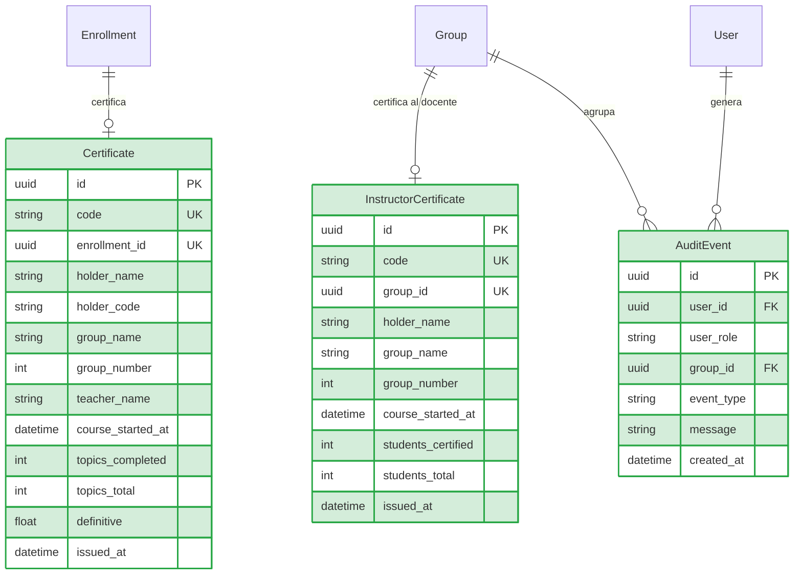
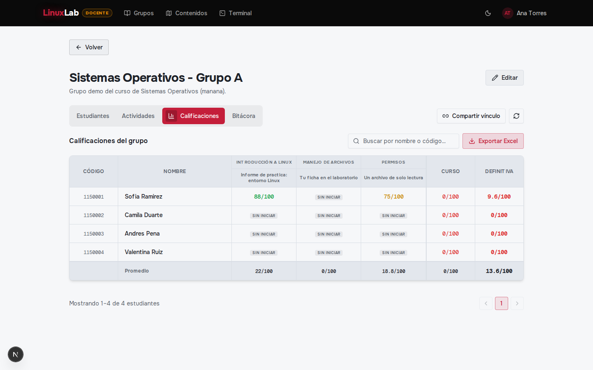
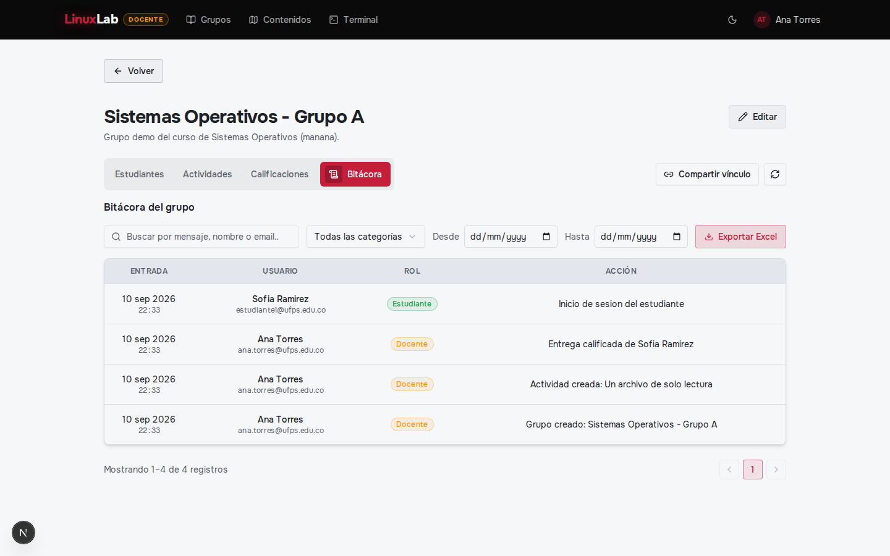
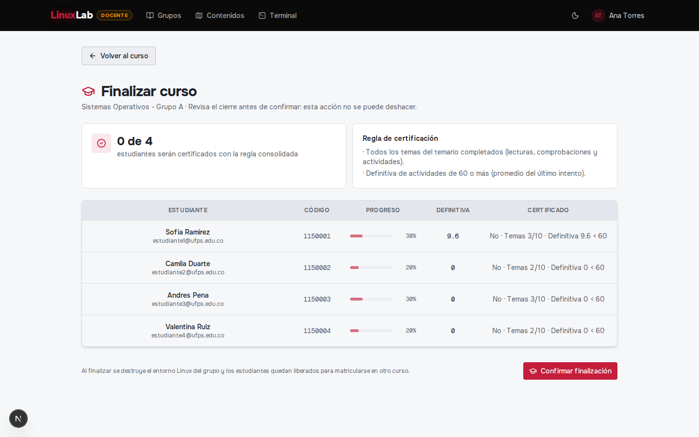
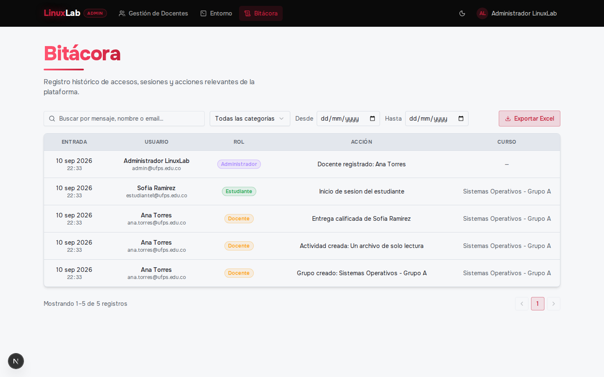
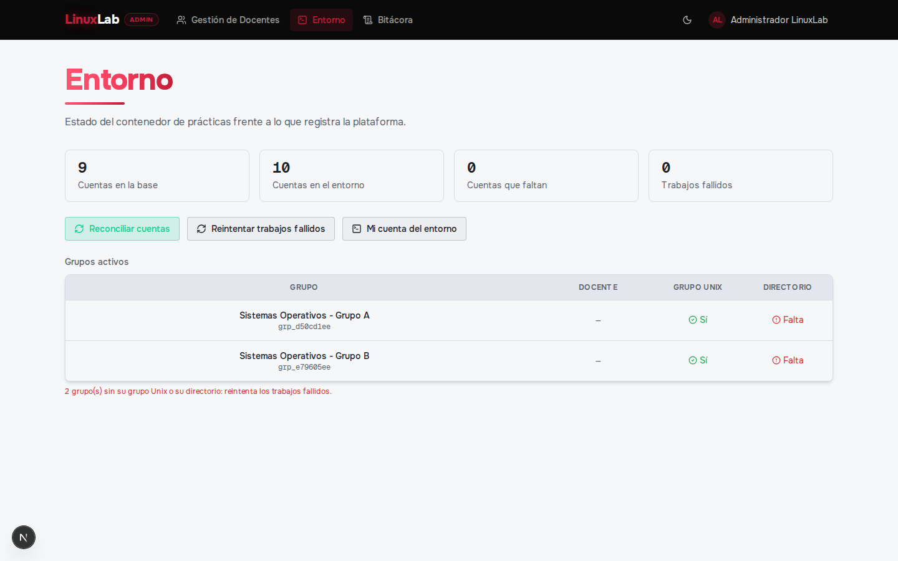
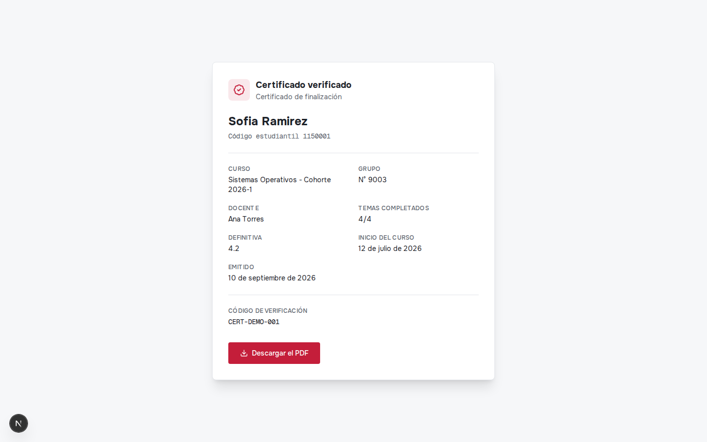

# Backlog Iteración 5: Seguimiento, auditoría y cierre

**Fecha de ejecución:** 24 de agosto – 5 de septiembre de 2026
**Módulo:** Seguimiento, auditoría y cierre

---

## 1. Análisis

### 1.1 Propósito y objetivo del ciclo

En la quinta iteración se cerró el ciclo de vida del curso. El docente consulta el avance y las calificaciones de su grupo, exporta el cuaderno a Excel y da por finalizado el grupo, momento en el que la plataforma evalúa la regla de certificación y emite los certificados de los estudiantes elegibles y el del instructor. Cualquier persona verifica la autenticidad de un certificado con su código único y descarga su PDF sin necesidad de sesión. El docente consulta la bitácora de su grupo y el administrador la del sistema con filtros por criterio; además, el administrador puede reintentar el aprovisionamiento de las cuentas o directorios del entorno que hayan fallado. Se prioriza este módulo al final porque consume la información que producen todos los ciclos anteriores: el avance del temario, las actividades y las matrículas.

### 1.2 Backlog del ciclo

| CU | RF / RNF incluidos | Prioridad | Descripción |
|----|--------------------|-----------|-------------|
| CU21 | RF-30 | Alta | Consulta del avance y las calificaciones de los estudiantes por actividad. |
| CU22 | RF-31 | Alta | Exportación del reporte de seguimiento del grupo en formato Excel. |
| CU23 | RF-32, RF-33 | Alta | Finalización del grupo, emisión automática de certificados y envío por correo. |
| CU24 | RF-34 | Alta | Verificación pública de la autenticidad de un certificado por su código único. |
| CU25 | RF-35 | Media | Consulta de la bitácora de eventos del grupo con filtros. |
| CU26 | RF-36 | Media | Consulta de la bitácora de eventos del sistema con filtros. |
| CU27 | RF-37 | Media | Reintento manual del aprovisionamiento de cuentas o directorios fallidos del entorno. |
| RNF-05 | RNF-05 | Alta | La arquitectura debe sostener al menos 40 sesiones simultáneas sobre la infraestructura del Departamento de Sistemas. |

### 1.3 Criterios de aceptación

| CU | Criterios de aceptación |
|----|-------------------------|
| CU21 | 1. El docente visualiza el avance y las calificaciones de cada estudiante por actividad. 2. Puede consultar el rendimiento individual de un estudiante. |
| CU22 | 1. El docente exporta el cuaderno de seguimiento del grupo a un archivo Excel con las actividades y sus promedios. |
| CU23 | 1. Al finalizar, se certifican los estudiantes con todo el temario completado y una definitiva de 60 o más. 2. Se emite el certificado del instructor con el resumen del grupo. 3. Los certificados se envían por correo y el entorno del grupo se desmonta. |
| CU24 | 1. Cualquier persona verifica un certificado por su código sin iniciar sesión. 2. Un código inexistente se rechaza. 3. El PDF del certificado se descarga desde la verificación. |
| CU25 | 1. El docente consulta los eventos de sus grupos con filtros por criterio. |
| CU26 | 1. El administrador consulta los eventos del sistema con filtros por criterio. |
| CU27 | 1. El administrador consulta el estado del entorno frente a la base de datos. 2. Reencola el aprovisionamiento de las cuentas o directorios fallidos. |
| RNF-05 | 1. El sistema sostiene 40 sesiones de terminal simultáneas; la prueba de carga abre 40 y todas se establecen. |

## 2. Diseño

### 2.1 Modelo de datos de la iteración

En esta iteración se introducen las entidades del cierre y la trazabilidad. `Certificate` es el certificado de un estudiante, enlazado a su matrícula y con los datos congelados al momento de la emisión (nombre, código, grupo, docente, temas completados, definitiva y fecha), más un código único que lo hace verificable. `InstructorCertificate` es el certificado del docente por el grupo, con el resumen de estudiantes certificados sobre el total. `AuditEvent` es la bitácora: formaliza en el modelo los eventos que el sistema venía registrando desde la primera iteración (inicio y cierre de sesión, registro de docentes y estudiantes, creación y cambio de estado de actividades, entregas y calificaciones, finalización y archivado), y los asocia al usuario, su rol y el grupo cuando aplica. Se conservan todas las entidades de los ciclos anteriores.

### 2.2 Decisiones técnicas del ciclo

La finalización del curso se resolvió como una operación transaccional e irreversible que evalúa la **regla de certificación** —todo el temario completado y una definitiva de 60 o más— y, con ese resultado, emite los certificados y el acta con los datos **congelados** en el momento del cierre. Esto evita que un certificado cambie si después se altera una actividad o una matrícula: el documento refleja el estado del curso el día que se cerró. En la misma transacción se encolan los correos de los certificados y el desmontaje del entorno, de modo que el cierre no deja el curso a medias. La definitiva se calcula con el último intento válido de cada actividad, la misma regla que ve el estudiante durante el curso.

El certificado se diseñó como un **documento verificable por un código único**: se renderiza como PDF con las fuentes de la marca y se verifica desde una ruta pública, sin sesión y con límite de consultas para contener la enumeración de códigos, que además falla en cuanto el código no existe. La verificación no expone datos que el certificado no declare: nombre del titular, curso, grupo, docente, temas completados, definitiva y fecha de emisión.

La bitácora se construye sobre una tabla de eventos que registra el **qué, quién, cuándo y en qué grupo**, y se consulta con filtros por tipo, categoría, grupo, rango de fechas y texto. El alcance depende del rol: el docente solo ve los eventos de sus grupos y el administrador los del sistema completo. La misma tabla alimenta la vista reciente de la bitácora dentro del detalle del grupo, para que el docente no tenga que salir de su curso.

La exportación del seguimiento se resolvió en el **cliente**: el cuaderno de calificaciones se consulta al servidor y el navegador arma el archivo Excel, de modo que el backend no genera binarios de reporte ni carga librerías de hoja de cálculo. Para el aprovisionamiento, el administrador dispone de un panel que compara el estado del contenedor con lo que registra la base de datos y reencola los trabajos fallidos; el mismo mecanismo de reconciliación repara cuentas y directorios perdidos sin intervención manual sobre el servidor.

La capacidad de sesiones (RNF-05) no se resolvió con un límite en la aplicación, sino con el presupuesto de recursos del entorno (memoria, CPU y procesos del contenedor, más los cgroups por usuario) descrito en la iteración 2. La verificación se hizo en dos niveles: una prueba de concurrencia en la suite, que abre 40 conexiones simultáneas contra el gateway con la PTY simulada, y una **prueba de carga real** con un script aparte que abre 40 sesiones de terminal contra el entorno y las mantiene; el resultado fue de 40 de 40 sesiones establecidas en 75 ms.

## 3. Codificación

### 3.1 Vistas implementadas

**Seguimiento del grupo** — `/grupos/[id]?tab=calificaciones` (Docente): cuaderno de calificaciones por actividad y por estudiante, con el botón de exportación a Excel.

**Bitácora del grupo** — `/grupos/[id]?tab=bitacora` (Docente): eventos recientes del grupo con sus filtros.

**Finalizar curso** — `/grupos/[id]/finalizar` (Docente): vista previa de la regla de certificación y confirmación del cierre.

**Bitácora del sistema** — `/admin/bitacora` (Administrador): consulta global de eventos con filtros y exportación.

**Entorno y aprovisionamiento** — `/admin/entorno` (Administrador): estado del contenedor frente a la base de datos y reintento de las cuentas fallidas.

**Verificación de certificado** — `/verificar/[code]` (Público): verificación de autenticidad y descarga del PDF sin iniciar sesión.

### 3.2 Endpoints implementados

| Método | Ruta | Actor | Descripción |
|--------|------|-------|-------------|
| GET | `/api/groups/:id/progress` | Docente | Avance de los estudiantes por tema. |
| GET | `/api/groups/:id/gradebook` | Docente | Cuaderno de calificaciones del grupo (fuente del Excel). |
| GET | `/api/groups/:id/gradebook/students/:studentId` | Docente | Rendimiento individual de un estudiante. |
| GET | `/api/groups/:id/finalize/preview` | Docente | Vista previa de la regla de certificación. |
| POST | `/api/groups/:id/finalize` | Docente | Finaliza el grupo, emite certificados y desmonta el entorno. |
| GET | `/api/groups/:id/certificates` | Docente | Certificados emitidos por el grupo. |
| GET | `/api/groups/:id/certificates/acta` | Docente | Acta del grupo en PDF. |
| GET | `/api/certificates/mine` | Usuario autenticado | Certificados del usuario. |
| GET | `/api/certificates/:code` | Público | Verifica un certificado por su código. |
| GET | `/api/certificates/:code/pdf` | Público | Descarga el PDF del certificado. |
| GET | `/api/audit` | Docente/Administrador | Bitácora con filtros por criterio y alcance por rol. |
| GET | `/api/audit/groups/:id/recent` | Docente/Administrador | Eventos recientes de un grupo. |
| GET | `/api/admin/environment` | Administrador | Estado del entorno frente a la base de datos. |
| POST | `/api/admin/environment/requeue` | Administrador | Reencola los aprovisionamientos fallidos. |
| POST | `/api/admin/environment/account` | Administrador | Asegura la cuenta del propio administrador. |
| POST | `/api/admin/linux-accounts/reconcile` | Administrador | Reconciliación global del entorno. |
| POST | `/api/groups/:id/reconcile` | Docente | Reconciliación del entorno del grupo. |

## 4. Pruebas

### 4.1 Pruebas del ciclo

Pruebas de rutas HTTP con Jest + supertest sobre un mock del cliente Prisma y la sesión como JWT real; las fronteras pesadas (renderizado de PDF, finalización, reconciliación) se sustituyen en la frontera. La capacidad se cubre además con una prueba de concurrencia en Jest y con el script de carga real. Comando: `npm run test:it5` desde `backend/`.

| CU / RF / RNF | Endpoint / pieza | Casos |
|---------------|------------------|-------|
| CU24, RF-34 | `GET /api/certificates/:code`, `/:code/pdf`, `/mine` | Verificación pública (200); código inexistente (404); PDF `application/pdf`; certificados propios (200) y sin sesión (401). |
| CU23, RF-32, RF-33 | `finalize/preview`, `POST /finalize`, `/certificates`, `/certificates/acta` | Vista previa (200); finalización con certificados (200); estudiante no finaliza (403); listado de certificados (200); acta en PDF (200). |
| CU25, CU26, RF-35, RF-36 | `GET /api/audit`, `/groups/:id/recent` | 401 sin sesión; 403 estudiante; docente con su alcance (200); admin con filtros (200); bitácora de grupo (200). |
| CU21, CU22, RF-30, RF-31 | `gradebook`, `gradebook/students/:studentId`, `progress` | 401 sin sesión; 403 estudiante; cuaderno (200); rendimiento individual (200); avance del grupo (200 y 403). |
| CU27, RF-37 | `admin/environment`, `environment/requeue`, `environment/account`, `linux-accounts/reconcile`, `groups/:id/reconcile` | Admin 200 y docente 403; snapshot (200); reintento de fallidos (200); cuenta propia (200); reconciliación de grupo (200). |
| RNF-05 | `gateway` (concurrencia) y `scripts/loadtest-terminal.mjs` (carga real) | 40 conexiones simultáneas establecidas sin serializarse; una sesión sin matrícula no ocupa cupo; carga real 40/40 en 75 ms. |

Total de la iteración: 31 pruebas en verde (10 de certificados y cierre, 6 de auditoría, 6 de seguimiento, 7 de aprovisionamiento y 2 de capacidad). La suite completa del proyecto queda en 146 pruebas verdes, sumando las 21 de la iteración 1, las 30 de la iteración 2, las 36 de la iteración 3, las 28 de la iteración 4 y las 31 de la iteración 5.
