# Análisis y Diseño — LinuxLab UFPS

**Proyecto:** LinuxLab UFPS
**Fecha:** 2026-09-04
**Estado:** Borrador

---

## 1. Casos de uso

A partir de los 37 requerimientos funcionales consolidados se definieron los casos de uso que representan las interacciones principales entre los actores del sistema y las funcionalidades del laboratorio virtual.

### 1.1 Actores

| Actor | Descripción |
|-------|-------------|
| **Estudiante** | Usuario matriculado en un grupo de laboratorio. Navega el temario, usa la terminal, resuelve actividades y consulta sus calificaciones. |
| **Docente** | Usuario responsable de uno o más grupos de laboratorio. Crea y administra grupos, actividades, califica entregas y genera reportes. |
| **Administrador** | Usuario con privilegios elevados. Gestiona docentes, aprueba provisionamiento y consulta la auditoría global del sistema. |
| **Sistema** | Actor no humano. Envía correos electrónicos, genera certificados y ejecuta tareas automáticas en segundo plano. |

### 1.2 Tabla de casos de uso

| CU | Nombre | Actor principal | Actor secundario | RFs |
|----|--------|-----------------|------------------|-----|
| CU-01 | Registrarse | Estudiante | Sistema | RF-01, RF-02 |
| CU-02 | Iniciar sesión | Cualquier usuario | Sistema | RF-01, RF-04 |
| CU-03 | Restablecer contraseña | Cualquier usuario | Sistema | RF-03 |
| CU-04 | Registrar docente | Administrador | Sistema | RF-06, RF-07 |
| CU-05 | Listar y gestionar docentes | Administrador | — | RF-08, RF-09 |
| CU-06 | Crear grupo | Docente | — | RF-10 |
| CU-07 | Editar grupo | Docente | — | RF-11 |
| CU-08 | Archivar grupo | Docente | — | RF-12 |
| CU-09 | Generar enlace de invitación | Docente | — | RF-13 |
| CU-10 | Vincular estudiante individual | Docente | — | RF-14 |
| CU-11 | Navegar temario | Estudiante | — | RF-15 |
| CU-12 | Usar simuladores | Estudiante | — | RF-16 |
| CU-13 | Resolver actividades del temario | Estudiante | — | RF-17 |
| CU-14 | Usar terminal Linux | Estudiante | — | RF-18, RF-19 |
| CU-15 | Crear actividad personalizada | Docente | — | RF-20, RF-21 |
| CU-16 | Habilitar/deshabilitar actividad | Docente | — | RF-22, RF-23 |
| CU-17 | Resolver actividad automática | Estudiante | — | RF-24, RF-25, RF-29 |
| CU-18 | Entregar actividad manual | Estudiante | — | RF-26 |
| CU-19 | Calificar entrega manual | Docente | Sistema | RF-27 |
| CU-20 | Consultar calificación | Estudiante | — | RF-28 |
| CU-21 | Consultar avance del grupo | Docente | — | RF-30 |
| CU-22 | Exportar reporte Excel | Docente | — | RF-31 |
| CU-23 | Finalizar grupo y certificar | Docente | Sistema | RF-32, RF-33 |
| CU-24 | Verificar certificado | Cualquier persona | — | RF-34 |
| CU-25 | Consultar auditoría de grupo | Docente | — | RF-35 |
| CU-26 | Consultar auditoría del sistema | Administrador | — | RF-36 |
| CU-27 | Reintentar aprovisionamiento | Administrador | — | RF-37 |

> **Nota:** El RF-05 (control de acceso por roles) es transversal y se valida en cada operación protegida del sistema, por lo que no constituye un caso de uso independiente.

### 1.3 Diagrama general de casos de uso

```plantuml
@startuml
left to right direction

title Diagrama General de Casos de Uso — LinuxLab UFPS

rectangle "Laboratorio Virtual de Linux" {

  package "Autenticación" {
    usecase "CU-01\nRegistrarse" as UC01
    usecase "CU-02\nIniciar sesión" as UC02
    usecase "CU-03\nRestablecer\ncontraseña" as UC03
  }

  package "Gestión de Docentes" {
    usecase "CU-04\nRegistrar docente" as UC04
    usecase "CU-05\nListar y gestionar\ndocentes" as UC05
  }

  package "Gestión de Grupos" {
    usecase "CU-06\nCrear grupo" as UC06
    usecase "CU-07\nEditar grupo" as UC07
    usecase "CU-08\nArchivar grupo" as UC08
    usecase "CU-09\nGenerar enlace\nde invitación" as UC09
    usecase "CU-10\nVincular estudiante\nindividual" as UC10
  }

  package "Contenido y Terminal" {
    usecase "CU-11\nNavegar temario" as UC11
    usecase "CU-12\nUsar simuladores" as UC12
    usecase "CU-13\nResolver actividades\ndel temario" as UC13
    usecase "CU-14\nUsar terminal\nLinux" as UC14
  }

  package "Actividades Personalizadas" {
    usecase "CU-15\nCrear actividad\npersonalizada" as UC15
    usecase "CU-16\nHabilitar/deshabilitar\nactividad" as UC16
    usecase "CU-17\nResolver actividad\nautomática" as UC17
    usecase "CU-18\nEntregar actividad\nmanual" as UC18
    usecase "CU-19\nCalificar entrega\nmanual" as UC19
    usecase "CU-20\nConsultar\ncalificación" as UC20
  }

  package "Seguimiento y Reportes" {
    usecase "CU-21\nConsultar avance\ndel grupo" as UC21
    usecase "CU-22\nExportar reporte\nExcel" as UC22
  }

  package "Certificados" {
    usecase "CU-23\nFinalizar grupo\ny certificar" as UC23
    usecase "CU-24\nVerificar certificado" as UC24
  }

  package "Auditoría" {
    usecase "CU-25\nConsultar auditoría\nde grupo" as UC25
    usecase "CU-26\nConsultar auditoría\ndel sistema" as UC26
    usecase "CU-27\nReintentar\naprovisionamiento" as UC27
  }
}

actor "Estudiante" as Est
actor "Docente" as Doc
actor "Administrador" as Admin
actor "Sistema" as Sys

Est --> UC01
Est --> UC02
Est --> UC03
Est --> UC11
Est --> UC12
Est --> UC13
Est --> UC14
Est --> UC17
Est --> UC18
Est --> UC20

Doc --> UC02
Doc --> UC06
Doc --> UC07
Doc --> UC08
Doc --> UC09
Doc --> UC10
Doc --> UC15
Doc --> UC16
Doc --> UC19
Doc --> UC21
Doc --> UC22
Doc --> UC23
Doc --> UC25

Admin --> UC02
Admin --> UC04
Admin --> UC05
Admin --> UC26
Admin --> UC27

UC01 ..> Sys : <<include>>
UC02 ..> Sys : <<include>>
UC04 ..> Sys : <<include>>
UC23 ..> Sys : <<include>>

UC17 ..> UC13 : <<extend>>
UC16 ..> UC15 : <<extend>>

@enduml
```

---

## 2. Matriz de trazabilidad RF → CU

| RF | CU(s) |
|----|-------|
| RF-01 | CU-01, CU-02 |
| RF-02 | CU-01 |
| RF-03 | CU-03 |
| RF-04 | CU-02 |
| RF-05 | Transversal (todos los CU protegidos) |
| RF-06 | CU-04 |
| RF-07 | CU-04 |
| RF-08 | CU-05 |
| RF-09 | CU-05 |
| RF-10 | CU-06 |
| RF-11 | CU-07 |
| RF-12 | CU-08 |
| RF-13 | CU-09 |
| RF-14 | CU-10 |
| RF-15 | CU-11 |
| RF-16 | CU-12 |
| RF-17 | CU-13 |
| RF-18 | CU-14 |
| RF-19 | CU-14 |
| RF-20 | CU-15 |
| RF-21 | CU-15 |
| RF-22 | CU-16 |
| RF-23 | CU-16 |
| RF-24 | CU-17 |
| RF-25 | CU-17 |
| RF-26 | CU-18 |
| RF-27 | CU-19 |
| RF-28 | CU-20 |
| RF-29 | CU-17 |
| RF-30 | CU-21 |
| RF-31 | CU-22 |
| RF-32 | CU-23 |
| RF-33 | CU-23 |
| RF-34 | CU-24 |
| RF-35 | CU-25 |
| RF-36 | CU-26 |
| RF-37 | CU-27 |

---

## 3. Anexo

La especificación detallada de cada caso de uso (tabla de especificación y diagrama de secuencia) se encuentra en el archivo:

**[annexes/cu-especificacion.md](annexes/cu-especificacion.md)**
