# Anexo — Especificación detallada de casos de uso

**Proyecto:** LinuxLab UFPS
**Fecha:** 2026-09-04
**Estado:** Borrador

---

## CU-01: Registrarse

### Tabla de especificación

| Campo | Descripción |
|-------|-------------|
| **ID** | CU-01 |
| **Nombre** | Registrarse |
| **Actor principal** | Estudiante |
| **Actor secundario** | Sistema |
| **RFs asociados** | RF-01, RF-02 |
| **Precondiciones** | El estudiante no tiene cuenta previa en la plataforma. |

**Flujo principal:**

1. El estudiante accede al formulario de registro.
2. El estudiante ingresa nombre, código institucional, dirección de correo electrónico y contraseña.
3. El sistema valida los campos (formato de email, código único, contraseña segura).
4. El sistema crea la cuenta del estudiante con estado "no verificado".
5. El sistema envía automáticamente un correo de verificación a la dirección proporcionada.
6. El sistema muestra un mensaje indicando que se debe verificar el correo.

**Flujos alternativos:**

- **A1:** El código o correo ya está registrado → El sistema muestra un error de duplicidad.
- **A2:** Los campos no cumplen las validaciones → El sistema muestra los errores de formato.

**Postcondiciones:**

- Se crea una cuenta de estudiante con estado "no verificado".
- Se envía un correo de verificación.

### Diagrama de casos de uso

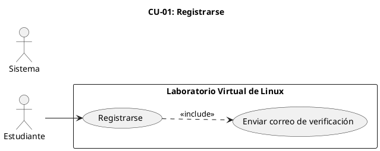

### Diagrama de secuencia

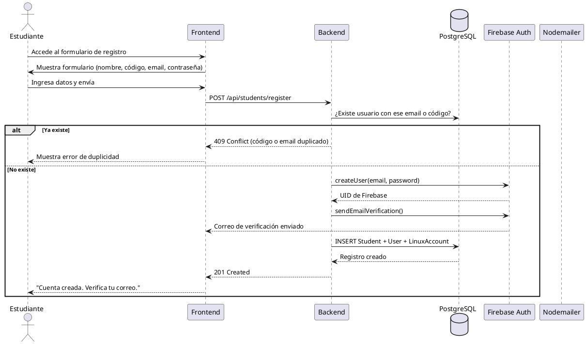

---

## CU-02: Iniciar sesión

### Tabla de especificación

| Campo | Descripción |
|-------|-------------|
| **ID** | CU-02 |
| **Nombre** | Iniciar sesión |
| **Actor principal** | Cualquier usuario |
| **Actor secundario** | Sistema |
| **RFs asociados** | RF-01, RF-04 |
| **Precondiciones** | El usuario tiene una cuenta creada y verificada. |

**Flujo principal:**

1. El usuario accede a la página de login.
2. El usuario elige iniciar sesión con email/contraseña o con Google.
3. **Opción email/contraseña:**
   - El usuario ingresa email y contraseña.
   - El sistema valida credenciales con Firebase Auth.
   - El sistema verifica que el correo esté verificado.
4. **Opción Google:**
   - El usuario selecciona "Iniciar con Google".
   - Firebase muestra el popup de selección de cuenta.
   - El sistema valida la cuenta de Google contra la base de datos.
5. El sistema firma un JWT con el perfil del usuario.
6. El sistema envía el JWT como cookie `httpOnly`.
7. El frontend redirige al usuario según su rol.

**Flujos alternativos:**

- **A1:** Credenciales inválidas → El sistema muestra "Email o contraseña incorrectos".
- **A2:** Correo no verificado → El sistema muestra "Debes verificar tu correo electrónico".
- **A3:** Cuenta de Google no registrada → El sistema muestra "Tu cuenta no está registrada en la plataforma".

**Postcondiciones:**

- El usuario tiene una sesión activa (cookie JWT).
- Se registra el evento de login en la bitácora.

### Diagrama de casos de uso

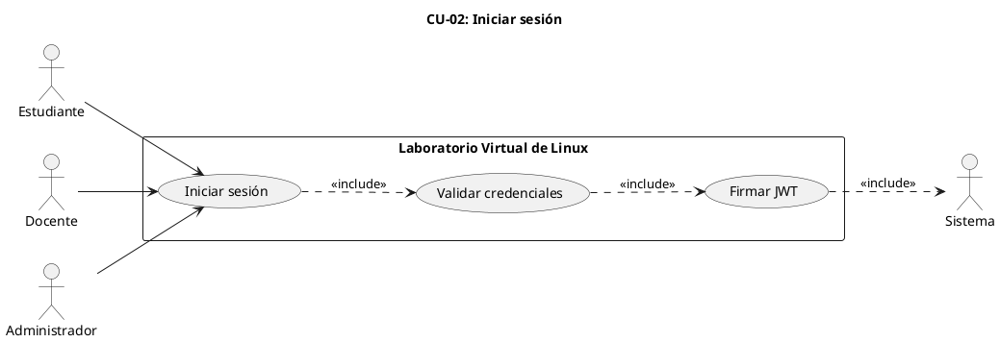

### Diagrama de secuencia

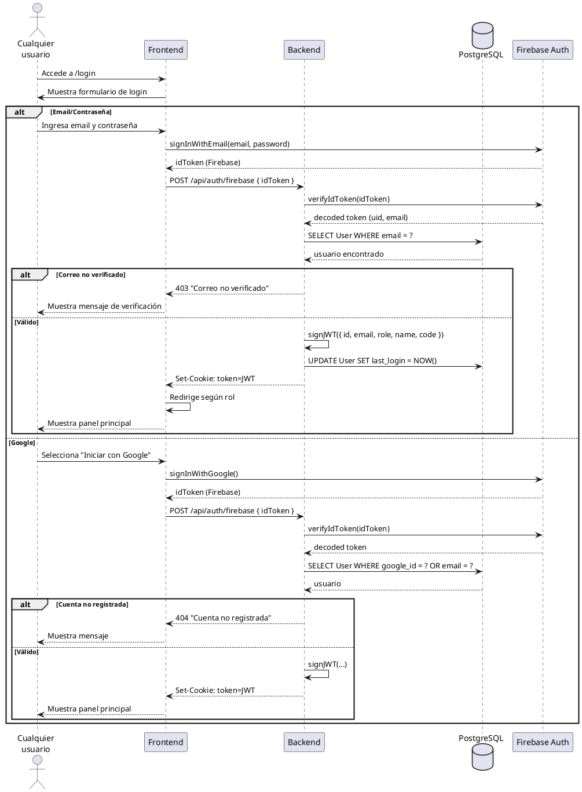

---

## CU-03: Restablecer contraseña

### Tabla de especificación

| Campo | Descripción |
|-------|-------------|
| **ID** | CU-03 |
| **Nombre** | Restablecer contraseña |
| **Actor principal** | Cualquier usuario |
| **Actor secundario** | Sistema |
| **RFs asociados** | RF-03 |
| **Precondiciones** | El usuario tiene una cuenta existente y verificada. |

**Flujo principal:**

1. El usuario accede a "¿Olvidaste tu contraseña?".
2. El usuario ingresa su dirección de correo electrónico.
3. El sistema valida que el correo exista en la base de datos.
4. El sistema envía un correo electrónico con un enlace de restablecimiento.
5. El usuario abre el enlace y accede al formulario de nueva contraseña.
6. El usuario ingresa y confirma la nueva contraseña.
7. El sistema actualiza la contraseña en Firebase Auth.
8. El sistema muestra un mensaje de éxito.

**Flujos alternativos:**

- **A1:** El correo no está registrado → El sistema muestra "Si el correo está registrado, recibirás un enlace".
- **A2:** El token expiró o es inválido → El sistema muestra "Enlace expirado, solicita uno nuevo".

**Postcondiciones:**

- La contraseña del usuario ha sido actualizada.

### Diagrama de casos de uso

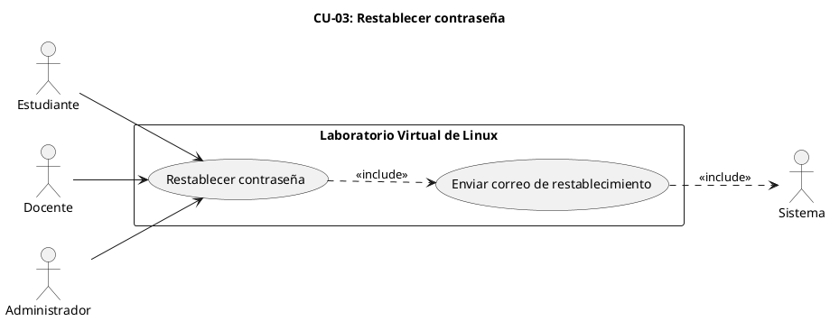

### Diagrama de secuencia

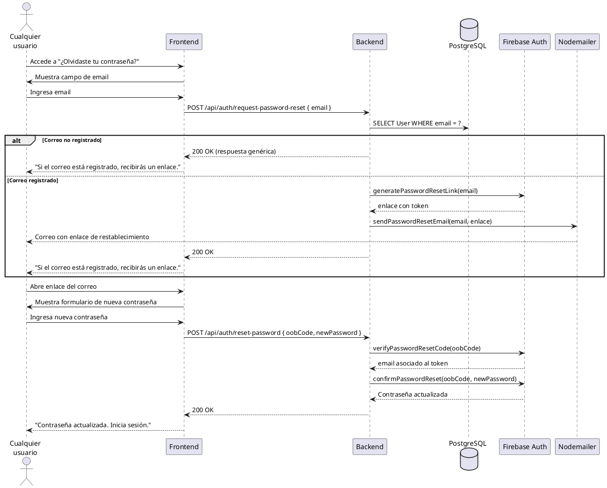

---

## CU-04: Registrar docente

### Tabla de especificación

| Campo | Descripción |
|-------|-------------|
| **ID** | CU-04 |
| **Nombre** | Registrar docente |
| **Actor principal** | Administrador |
| **Actor secundario** | Sistema |
| **RFs asociados** | RF-06, RF-07 |
| **Precondiciones** | El administrador tiene una sesión activa. |

**Flujo principal:**

1. El administrador accede a la sección de gestión de docentes.
2. El administrador selecciona "Registrar docente".
3. El administrador ingresa nombre, código institucional y dirección de correo electrónico.
4. El sistema valida los campos.
5. El sistema crea la cuenta del docente con estado "pendiente de activación".
6. El sistema envía automáticamente un correo electrónico al docente con un enlace para establecer su contraseña.
7. El sistema muestra confirmación del registro.

**Flujos alternativos:**

- **A1:** El código o correo ya está registrado → El sistema muestra error de duplicidad.
- **A2:** Los campos no son válidos → El sistema muestra errores de validación.

**Postcondiciones:**

- Se crea una cuenta de docente con estado "pendiente de activación".
- Se envía un correo con enlace de activación.

### Diagrama de casos de uso

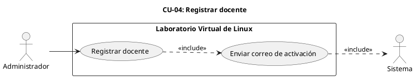

### Diagrama de secuencia

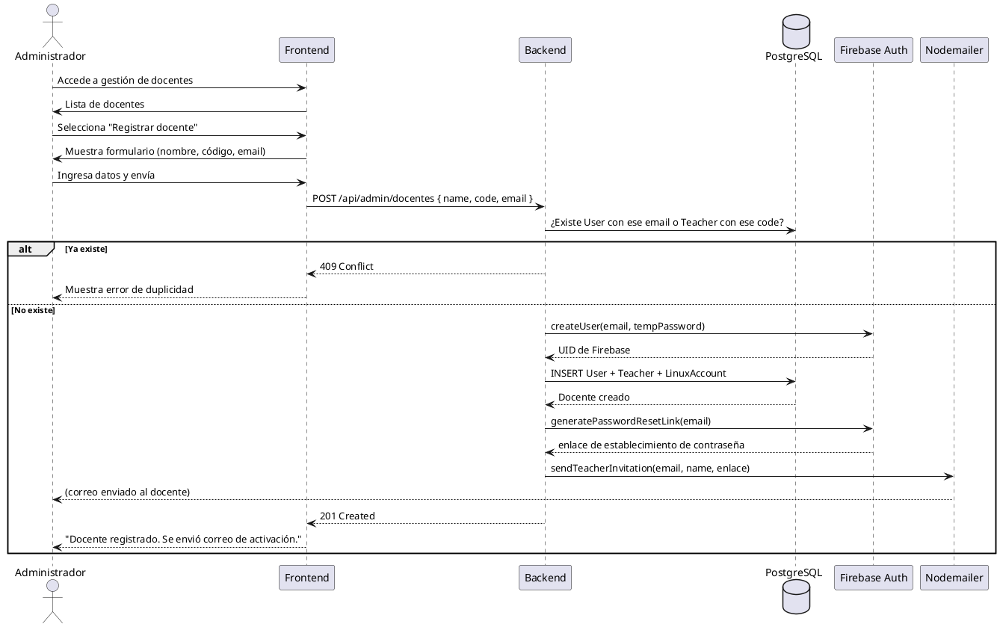

---

## CU-05: Listar y gestionar docentes

### Tabla de especificación

| Campo | Descripción |
|-------|-------------|
| **ID** | CU-05 |
| **Nombre** | Listar y gestionar docentes |
| **Actor principal** | Administrador |
| **Actor secundario** | — |
| **RFs asociados** | RF-08, RF-09 |
| **Precondiciones** | El administrador tiene una sesión activa. |

**Flujo principal:**

1. El administrador accede a la sección de gestión de docentes.
2. El sistema muestra una tabla con los docentes registrados.
3. El administrador puede filtrar por nombre o código.
4. Para activar/desactivar un docente, el administrador selecciona la acción correspondiente.
5. El sistema cambia el estado del docente.
6. El sistema muestra confirmación.

**Flujos alternativos:**

- **A1:** No hay docentes registrados → El sistema muestra "No hay docentes registrados".

**Postcondiciones:**

- El estado del docente ha sido actualizado.

### Diagrama de casos de uso

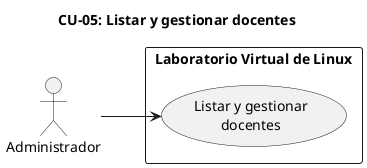

### Diagrama de secuencia

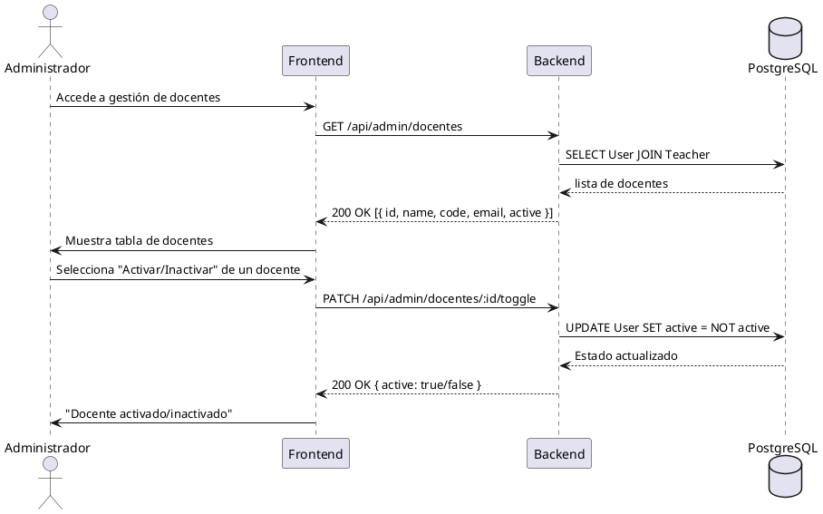

---

## CU-06: Crear grupo

### Tabla de especificación

| Campo | Descripción |
|-------|-------------|
| **ID** | CU-06 |
| **Nombre** | Crear grupo |
| **Actor principal** | Docente |
| **Actor secundario** | — |
| **RFs asociados** | RF-10 |
| **Precondiciones** | El docente tiene una sesión activa. |

**Flujo principal:**

1. El docente accede a su panel de grupos.
2. El docente selecciona "Crear grupo".
3. El docente ingresa nombre y descripción del grupo.
4. El sistema valida los campos.
5. El sistema crea el grupo con estado "activo".
6. El sistema genera automáticamente un directorio de trabajo en el entorno Linux.
7. El sistema muestra confirmación.

**Flujos alternativos:**

- **A1:** Ya existe un grupo con ese nombre → El sistema muestra error de duplicidad.

**Postcondiciones:**

- Se crea un grupo con estado "activo".
- Se crea el directorio del grupo en el entorno Linux.

### Diagrama de casos de uso

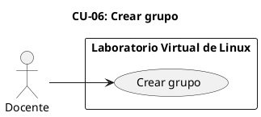

### Diagrama de secuencia

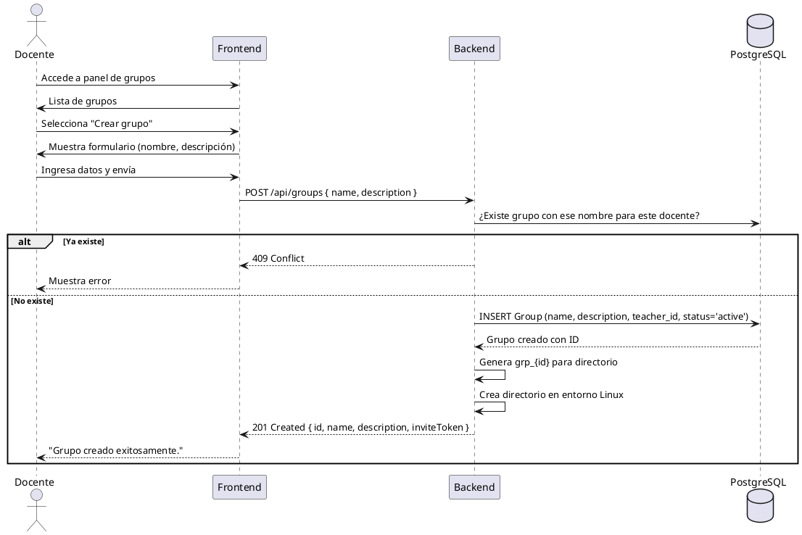

---

## CU-07: Editar grupo

### Tabla de especificación

| Campo | Descripción |
|-------|-------------|
| **ID** | CU-07 |
| **Nombre** | Editar grupo |
| **Actor principal** | Docente |
| **Actor secundario** | — |
| **RFs asociados** | RF-11 |
| **Precondiciones** | El docente tiene una sesión activa y es propietario del grupo. |

**Flujo principal:**

1. El docente selecciona un grupo de su lista.
2. El docente selecciona "Editar".
3. El docente modifica nombre y/o descripción.
4. El sistema valida los cambios.
5. El sistema actualiza la información del grupo.
6. El sistema muestra confirmación.

**Flujos alternativos:**

- **A1:** El nuevo nombre ya existe para otro grupo del docente → El sistema muestra error.

**Postcondiciones:**

- La información del grupo ha sido actualizada.

### Diagrama de casos de uso


### Diagrama de secuencia

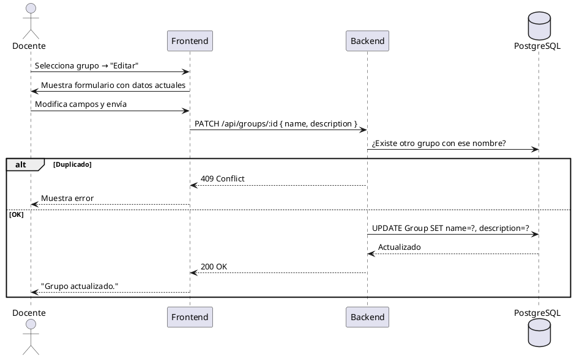

---

## CU-08: Archivar grupo

### Tabla de especificación

| Campo | Descripción |
|-------|-------------|
| **ID** | CU-08 |
| **Nombre** | Archivar grupo |
| **Actor principal** | Docente |
| **Actor secundario** | — |
| **RFs asociados** | RF-12 |
| **Precondiciones** | El docente tiene una sesión activa, es propietario del grupo y el grupo tiene estado "activo". |

**Flujo principal:**

1. El docente selecciona un grupo activo.
2. El docente selecciona "Archivar grupo".
3. El sistema muestra confirmación.
4. El docente confirma.
5. El sistema cambia el estado del grupo a "archivado".
6. El sistema muestra confirmación.

**Flujos alternativos:**

- **A1:** El docente cancela la acción → El sistema no realiza cambios.

**Postcondiciones:**

- El grupo tiene estado "archivado".
- Los estudiantes del grupo no pueden realizar nuevas entregas.

### Diagrama de casos de uso

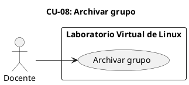

### Diagrama de secuencia

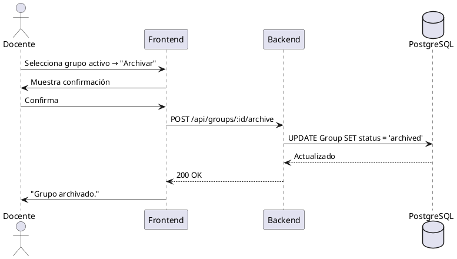

---

## CU-09: Generar enlace de invitación

### Tabla de especificación

| Campo | Descripción |
|-------|-------------|
| **ID** | CU-09 |
| **Nombre** | Generar enlace de invitación |
| **Actor principal** | Docente |
| **Actor secundario** | — |
| **RFs asociados** | RF-13 |
| **Precondiciones** | El docente tiene una sesión activa y es propietario del grupo. |

**Flujo principal:**

1. El docente selecciona un grupo.
2. El docente selecciona "Generar enlace de invitación".
3. El sistema genera un token único y lo asocia al grupo.
4. El sistema muestra el enlace completo.
5. El docente puede copiar el enlace y compartirlo con los estudiantes.

**Flujos alternativos:**

- **A1:** Ya existe un enlace activo → El sistema muestra el enlace actual con opción de renovar.
- **A2:** El docente selecciona "Renovar enlace" → El sistema genera un nuevo token y invalida el anterior.

**Postcondiciones:**

- Existe un enlace de invitación válido para el grupo.

### Diagrama de casos de uso

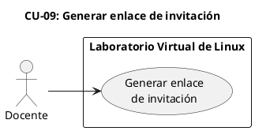

### Diagrama de secuencia

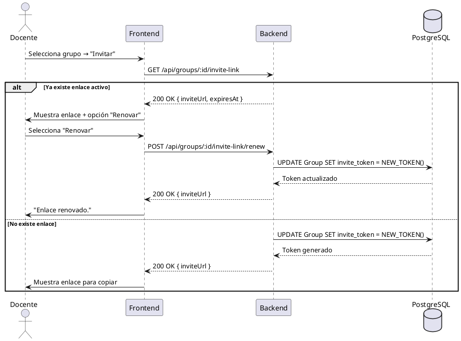

---

## CU-10: Vincular estudiante individual

### Tabla de especificación

| Campo | Descripción |
|-------|-------------|
| **ID** | CU-10 |
| **Nombre** | Vincular estudiante individual |
| **Actor principal** | Docente |
| **Actor secundario** | — |
| **RFs asociados** | RF-14 |
| **Precondiciones** | El docente tiene una sesión activa y es propietario del grupo. |

**Flujo principal:**

1. El docente selecciona un grupo.
2. El docente selecciona "Vincular estudiante".
3. El docente ingresa el email o código del estudiante.
4. El sistema busca el estudiante en la base de datos.
5. El sistema crea la matrícula.
6. El sistema muestra confirmación.

**Flujos alternativos:**

- **A1:** El estudiante no existe → El sistema muestra "Estudiante no encontrado".
- **A2:** El estudiante ya está matriculado → El sistema muestra "El estudiante ya está en este grupo".

**Postcondiciones:**

- El estudiante queda matriculado en el grupo.

### Diagrama de casos de uso

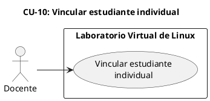

### Diagrama de secuencia

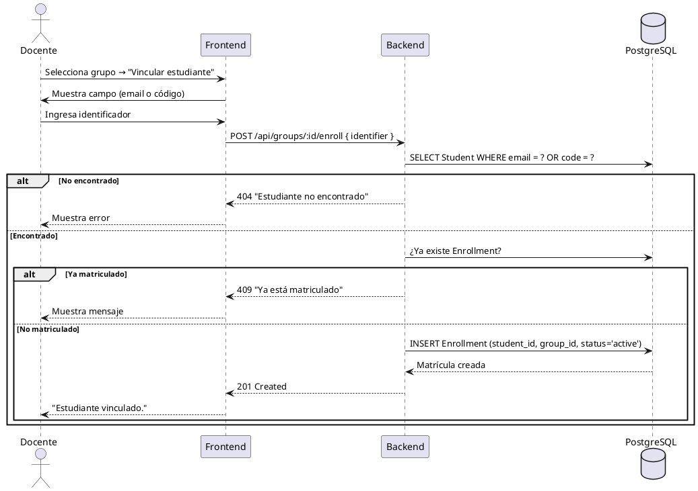

---

## CU-11: Navegar temario

### Tabla de especificación

| Campo | Descripción |
|-------|-------------|
| **ID** | CU-11 |
| **Nombre** | Navegar temario |
| **Actor principal** | Estudiante |
| **Actor secundario** | — |
| **RFs asociados** | RF-15 |
| **Precondiciones** | El estudiante tiene una sesión activa y está matriculado en un grupo. |

**Flujo principal:**

1. El estudiante accede a la sección de temario.
2. El sistema muestra la lista de temas disponibles para su grupo.
3. El estudiante selecciona un tema.
4. El sistema muestra el contenido del tema.
5. El estudiante navega entre los subtemas.

**Flujos alternativos:**

- **A1:** No hay temas habilitados para el grupo → El sistema muestra "No hay temas disponibles".

**Postcondiciones:**

- No hay cambios en el estado del sistema.

### Diagrama de casos de uso

```plantuml
@startuml
left to right direction

title CU-11: Navegar temario

rectangle "Laboratorio Virtual de Linux" {
  usecase "Navegar temario" as UC11
}

actor "Estudiante" as Est

Est --> UC11

@enduml
```

### Diagrama de secuencia

```plantuml
@startuml
actor Estudiante as E
participant "Frontend" as FE
participant "Backend" as BE
database "PostgreSQL" as DB

E -> FE : Accede a temario
FE -> BE : GET /api/enrollments/:id/topics
BE -> DB : SELECT Topic WHERE group_id = ?
DB --> BE : lista de temas
BE --> FE : 200 OK [{ order, slug, title, description }]
FE -> E : Muestra lista de temas

E -> FE : Selecciona un tema
FE -> BE : GET /api/topics/:slug
BE -> DB : SELECT Topic + Subtopic + content
DB --> BE : contenido del tema
BE --> FE : 200 OK { title, subtopics[], content }
FE -> E : Muestra contenido (texto, video, enlaces)

@enduml
```

---

## CU-12: Usar simuladores

### Tabla de especificación

| Campo | Descripción |
|-------|-------------|
| **ID** | CU-12 |
| **Nombre** | Usar simuladores |
| **Actor principal** | Estudiante |
| **Actor secundario** | — |
| **RFs asociados** | RF-16 |
| **Precondiciones** | El estudiante está navegando el temario y ha seleccionado un tema con simulador asociado. |

**Flujo principal:**

1. El estudiante selecciona un tema que contiene un simulador.
2. El sistema carga el simulador interactivo en el navegador.
3. El estudiante interactúa con el simulador.
4. El simulador muestra retroalimentación visual.

**Flujos alternativos:**

- **A1:** El tema no tiene simulador → No se muestra la opción.

**Postcondiciones:**

- No hay cambios en el estado del sistema.

### Diagrama de casos de uso

```plantuml
@startuml
left to right direction

title CU-12: Usar simuladores

rectangle "Laboratorio Virtual de Linux" {
  usecase "Usar simuladores" as UC12
}

actor "Estudiante" as Est

Est --> UC12

@enduml
```

### Diagrama de secuencia

```plantuml
@startuml
actor Estudiante as E
participant "Frontend" as FE
participant "Simulador\n(JavaScript)" as SIM

E -> FE : Selecciona tema con simulador
FE -> SIM : Carga simulador
SIM -> E : Muestra interfaz del simulador

E -> SIM : Interactúa (ingresa comandos)
SIM -> SIM : Evalúa comandos
SIM -> E : Muestra resultado + retroalimentación

@enduml
```

---

## CU-13: Resolver actividades del temario

### Tabla de especificación

| Campo | Descripción |
|-------|-------------|
| **ID** | CU-13 |
| **Nombre** | Resolver actividades del temario |
| **Actor principal** | Estudiante |
| **Actor secundario** | — |
| **RFs asociados** | RF-17 |
| **Precondiciones** | El estudiante tiene una sesión activa, está matriculado en un grupo y tiene una terminal Linux disponible. |

**Flujo principal:**

1. El estudiante navega el temario y encuentra una actividad asociada a una sección.
2. El estudiante selecciona la actividad.
3. El sistema muestra los criterios de evaluación y un botón "Evaluar".
4. El estudiante realiza los comandos necesarios en su terminal Linux.
5. El estudiante pulsa "Evaluar".
6. El sistema ejecuta el checker contra el entorno del estudiante.
7. El sistema muestra el resultado de cada aserción y el puntaje obtenido.
8. El estudiante puede reintentar cuantas veces sea necesario.

**Flujos alternativos:**

- **A1:** La cuenta Linux no está provisionada → El sistema muestra error.
- **A2:** Error en la evaluación → El sistema muestra "Error al evaluar, intenta de nuevo".

**Postcondiciones:**

- Se registra un intento de evaluación con su resultado.

### Diagrama de casos de uso

```plantuml
@startuml
left to right direction

title CU-13: Resolver actividades del temario

rectangle "Laboratorio Virtual de Linux" {
  usecase "Resolver actividades\ndel temario" as UC13
  usecase "Evaluar con checker" as UC13a
}

actor "Estudiante" as Est

Est --> UC13
UC13 ..> UC13a : <<include>>

@enduml
```

### Diagrama de secuencia

```plantuml
@startuml
actor Estudiante as E
participant "Frontend" as FE
participant "Backend" as BE
participant "SSH\n(entorno)" as SSH
participant "checker.py" as CHK
database "PostgreSQL" as DB

E -> FE : Selecciona actividad del temario
FE -> BE : GET /api/activities/:slug
BE --> FE : { title, instructions, checks[] }
FE -> E : Muestra criterios y botón "Evaluar"

E -> FE : Pulsa "Evaluar"
FE -> BE : POST /api/activities/:slug/check

BE -> DB : ¿Tiene matrícula activa?
BE -> DB : ¿Tiene cuenta Linux provisionada?

BE -> SSH : Ejecuta checker.py como el estudiante
SSH -> CHK : sudo -u <estudiante> checker.py
CHK -> CHK : Evalúa aserciones
CHK --> SSH : JSON resultados
SSH --> BE : Resultados

BE -> DB : INSERT TopicAttempt (score, passed, results)
BE --> FE : { passed, score, results[] }
FE -> E : Muestra resultado por aserción

@enduml
```

---

## CU-14: Usar terminal Linux

### Tabla de especificación

| Campo | Descripción |
|-------|-------------|
| **ID** | CU-14 |
| **Nombre** | Usar terminal Linux |
| **Actor principal** | Estudiante |
| **Actor secundario** | — |
| **RFs asociados** | RF-18, RF-19 |
| **Precondiciones** | El estudiante tiene una sesión activa y su cuenta Linux está provisionada. |

**Flujo principal:**

1. El estudiante accede a la sección de terminal.
2. El sistema establece una conexión WebSocket con el backend.
3. El backend abre una sesión SSH al entorno Linux como el estudiante.
4. El estudiante ve una terminal funcional en el navegador.
5. El estudiante ejecuta comandos y observa la salida en tiempo real.
6. El estudiante puede personalizar la apariencia.
7. El estudiante puede reiniciar la terminal cuando lo requiera.

**Flujos alternativos:**

- **A1:** La cuenta no está provisionada → El sistema muestra "Tu entorno no está disponible".
- **A2:** La conexión se pierde → El sistema intenta reconectar automáticamente.

**Postcondiciones:**

- Se establece una sesión de terminal funcional.
- Los archivos creados persisten entre sesiones.

### Diagrama de casos de uso

```plantuml
@startuml
left to right direction

title CU-14: Usar terminal Linux

rectangle "Laboratorio Virtual de Linux" {
  usecase "Usar terminal\nLinux" as UC14
  usecase "Establecer conexión\nWebSocket" as UC14a
  usecase "Personalizar\napariencia" as UC14b
  usecase "Reiniciar terminal" as UC14c
}

actor "Estudiante" as Est

Est --> UC14
UC14 ..> UC14a : <<include>>
UC14 ..> UC14b : <<extend>>
UC14 ..> UC14c : <<extend>>

@enduml
```

### Diagrama de secuencia

```plantuml
@startuml
actor Estudiante as E
participant "Frontend\n(Xterm.js)" as FE
participant "Backend\n(WebSocket)" as WS
participant "SSH Client" as SSH
participant "Entorno Linux\n(Ubuntu)" as LIN

E -> FE : Accede a terminal
FE -> WS : Conexión WebSocket /terminal

WS -> WS : Verifica JWT (cookie)
WS -> SSH : Conexión SSH al entorno
SSH -> LIN : ssh labadmin@entorno
LIN --> SSH : Sesión Bash

loop Sessión interactiva
  E -> FE : Ingresa comando
  FE -> WS : Mensaje WebSocket
  WS -> SSH : Envía comando
  SSH -> LIN : Ejecuta en contenedor
  LIN --> SSH : Salida
  SSH --> WS : Respuesta
  WS --> FE : Renderiza salida
  FE -> E : Muestra resultado
end

E -> FE : Selecciona "Reiniciar terminal"
FE -> WS : Reset
WS -> SSH : Mata sesión actual
WS -> SSH : Nueva conexión SSH
LIN --> WS : Nueva sesión
WS --> FE : Terminal reiniciada

@enduml
```

---

## CU-15: Crear actividad personalizada

### Tabla de especificación

| Campo | Descripción |
|-------|-------------|
| **ID** | CU-15 |
| **Nombre** | Crear actividad personalizada |
| **Actor principal** | Docente |
| **Actor secundario** | — |
| **RFs asociados** | RF-20, RF-21 |
| **Precondiciones** | El docente tiene una sesión activa y es propietario de al menos un grupo activo. |

**Flujo principal:**

1. El docente selecciona un grupo.
2. El docente selecciona "Crear actividad".
3. El docente ingresa título, enunciado, tipo (taller/quiz), dificultad y fecha de cierre.
4. El docente selecciona el tipo de revisión (automática/manual).
5. **Si es automática:** El docente configura las aserciones del catálogo.
6. **Si es manual:** El docente define los criterios de evaluación.
7. El docente define el límite de intentos.
8. El sistema valida la configuración.
9. El sistema crea la actividad y la publica en el grupo.
10. El sistema genera automáticamente una carpeta de trabajo.

**Flujos alternativos:**

- **A1:** La suma de puntajes no es 100 → El sistema muestra error de validación.
- **A2:** La fecha de cierre es anterior a la fecha actual → El sistema muestra error.

**Postcondiciones:**

- Se crea una actividad publicada y habilitada en el grupo.

### Diagrama de casos de uso

```plantuml
@startuml
left to right direction

title CU-15: Crear actividad personalizada

rectangle "Laboratorio Virtual de Linux" {
  usecase "Crear actividad\npersonalizada" as UC15
  usecase "Configurar aserciones\nde validación" as UC15a
}

actor "Docente" as Doc

Doc --> UC15
UC15 ..> UC15a : <<extend>>

@enduml
```

### Diagrama de secuencia

```plantuml
@startuml
actor Docente as D
participant "Frontend" as FE
participant "Backend" as BE
database "PostgreSQL" as DB

D -> FE : Selecciona grupo → "Crear actividad"
FE -> D : Muestra formulario

D -> FE : Ingresa: título, enunciado, tipo, dificultad, fecha cierre
D -> FE : Selecciona tipo de revisión (automática/manual)

alt Revisión automática
  D -> FE : Configura aserciones (tipo, params, puntaje)
  FE -> FE : Valida suma = 100
end

D -> FE : Define límite de intentos
D -> FE : Envía

FE -> BE : POST /api/groups/:groupId/activities { ... }

BE -> BE : Valida payload (zod schema)
BE -> DB : INSERT GroupActivity + ActivityCheck[]
DB --> BE : Actividad creada

BE -> BE : Genera workdir para la carpeta de trabajo
BE -> BE : Crea directorio en entorno Linux

BE --> FE : 201 Created
FE -> D : "Actividad creada y publicada."

@enduml
```

---

## CU-16: Habilitar/deshabilitar actividad

### Tabla de especificación

| Campo | Descripción |
|-------|-------------|
| **ID** | CU-16 |
| **Nombre** | Habilitar/deshabilitar actividad |
| **Actor principal** | Docente |
| **Actor secundario** | — |
| **RFs asociados** | RF-22, RF-23 |
| **Precondiciones** | El docente tiene una sesión activa, es propietario del grupo y la actividad no tiene entregas registradas. |

**Flujo principal:**

1. El docente selecciona una actividad de su grupo.
2. El docente selecciona "Habilitar" o "Deshabilitar".
3. El sistema cambia el estado de la actividad.
4. El docente puede extender la fecha de cierre de una actividad.
5. El sistema actualiza la fecha de cierre.

**Flujos alternativos:**

- **A1:** La actividad tiene entregas registradas → El sistema muestra "No se puede modificar".
- **A2:** La nueva fecha de cierre es anterior a la actual → El sistema muestra error.

**Postcondiciones:**

- El estado de la actividad ha sido actualizado.

### Diagrama de casos de uso

```plantuml
@startuml
left to right direction

title CU-16: Habilitar/deshabilitar actividad

rectangle "Laboratorio Virtual de Linux" {
  usecase "Habilitar actividad" as UC16a
  usecase "Deshabilitar actividad" as UC16b
  usecase "Definir fecha de cierre" as UC16c
  usecase "Habilitar/deshabilitar\nactividad" as UC16
}

actor "Docente" as Doc

Doc --> UC16
UC16 ..> UC16a : <<extend>>
UC16 ..> UC16b : <<extend>>
UC16 ..> UC16c : <<extend>>

@enduml
```

### Diagrama de secuencia

```plantuml
@startuml
actor Docente as D
participant "Frontend" as FE
participant "Backend" as BE
database "PostgreSQL" as DB

D -> FE : Selecciona actividad
FE -> D : Muestra estado actual + acciones disponibles

D -> FE : Selecciona "Deshabilitar"
FE -> BE : PATCH /api/groups/:groupId/activities/:id/disable

BE -> DB : ¿Tiene entregas?
alt Tiene entregas
  BE --> FE : 409 "No se puede deshabilitar con entregas"
  FE --> D : Muestra mensaje
else Sin entregas
  BE -> DB : UPDATE GroupActivity SET enabled = false
  BE --> FE : 200 OK
  FE --> D : "Actividad deshabilitada."
end

D -> FE : Selecciona "Extender fecha"
FE -> D : Muestra campo de nueva fecha

D -> FE : Ingresa nueva fecha y confirma
FE -> BE : PATCH /api/groups/:groupId/activities/:id/due { due_at }

BE -> DB : UPDATE GroupActivity SET due_at = ?
DB --> BE : Actualizado
BE --> FE : 200 OK
FE -> D : "Fecha de cierre extendida."

@enduml
```

---

## CU-17: Resolver actividad automática

### Tabla de especificación

| Campo | Descripción |
|-------|-------------|
| **ID** | CU-17 |
| **Nombre** | Resolver actividad automática |
| **Actor principal** | Estudiante |
| **Actor secundario** | — |
| **RFs asociados** | RF-24, RF-25, RF-29 |
| **Precondiciones** | El estudiante tiene una sesión activa, está matriculado en el grupo, la actividad está habilitada y no ha vencido. |

**Flujo principal:**

1. El estudiante accede a la actividad desde su grupo.
2. El sistema muestra las instrucciones y criterios de evaluación.
3. El estudiante realiza comandos en su terminal.
4. El estudiante pulsa "Evaluar".
5. El sistema ejecuta el checker contra el entorno del estudiante.
6. El sistema muestra el resultado de cada aserción y el puntaje.
7. El sistema registra el intento.
8. **Si es taller:** Reintentos ilimitados.
9. **Si es quiz:** Reintentos hasta el límite definido.
10. La calificación final se calcula según la política configurada.

**Flujos alternativos:**

- **A1:** Se alcanzó el límite de intentos → El sistema muestra "Has alcanzado el límite de intentos".
- **A2:** La actividad está vencida o deshabilitada → El sistema muestra "La actividad no está disponible".
- **A3:** La cuenta Linux no está provisionada → El sistema muestra error correspondiente.

**Postcondiciones:**

- Se registra un intento con su resultado y puntaje.

### Diagrama de casos de uso

```plantuml
@startuml
left to right direction

title CU-17: Resolver actividad automática

rectangle "Laboratorio Virtual de Linux" {
  usecase "Resolver actividad\nautomática" as UC17
  usecase "Evaluar con checker" as UC17a
  usecase "Registrar intento" as UC17b
}

actor "Estudiante" as Est

Est --> UC17
UC17 ..> UC17a : <<include>>
UC17 ..> UC17b : <<include>>

@enduml
```

### Diagrama de secuencia

```plantuml
@startuml
actor Estudiante as E
participant "Frontend" as FE
participant "Backend" as BE
participant "checker.py" as CHK
database "PostgreSQL" as DB

E -> FE : Accede a la actividad
FE -> BE : GET /api/group-activities/:id
BE --> FE : { title, instructions, checks[], attemptLimit, gradingPolicy }
FE -> E : Muestra criterios

loop Mientras pueda reintentar
  E -> FE : Realiza comandos en terminal
  E -> FE : Pulsa "Evaluar"

  FE -> BE : POST /api/group-activities/:id/check

  BE -> DB : ¿Tiene intentos disponibles?
  alt Sin intentos disponibles
    BE --> FE : 409 "Límite alcanzado"
    FE --> E : Muestra mensaje
  else Con intentos
    BE -> BE : Incrementa attempt_number atómicamente
    BE -> CHK : SSH + checker.py
    CHK --> BE : Resultados JSON

    BE -> DB : INSERT GroupSubmission (attempt_number, score, passed, results)
    BE -> BE : Calcula calificación final según política
    BE --> FE : { passed, score, results[], finalScore }
    FE -> E : Muestra resultado por aserción
  end
end

@enduml
```

---

## CU-18: Entregar actividad manual

### Tabla de especificación

| Campo | Descripción |
|-------|-------------|
| **ID** | CU-18 |
| **Nombre** | Entregar actividad manual |
| **Actor principal** | Estudiante |
| **Actor secundario** | — |
| **RFs asociados** | RF-26 |
| **Precondiciones** | El estudiante tiene una sesión activa, está matriculado en el grupo, la actividad es de revisión manual, está habilitada y dentro de la fecha de cierre. |

**Flujo principal:**

1. El estudiante accede a la actividad manual desde su grupo.
2. El sistema muestra las instrucciones y la fecha de cierre.
3. El estudiante prepara su evidencia.
4. El estudiante selecciona "Entregar".
5. El sistema captura el estado actual del directorio de trabajo.
6. El sistema registra la entrega con estado "enviada".
7. El sistema muestra confirmación.

**Flujos alternativos:**

- **A1:** La actividad está vencida → El sistema muestra "La fecha de cierre ha pasado".
- **A2:** Ya existe una entrega previa → El sistema muestra "Ya tienes una entrega para esta actividad".

**Postcondiciones:**

- Se registra una entrega con estado "enviada".

### Diagrama de casos de uso

```plantuml
@startuml
left to right direction

title CU-18: Entregar actividad manual

rectangle "Laboratorio Virtual de Linux" {
  usecase "Entregar actividad\nmanual" as UC18
  usecase "Capturar evidencia" as UC18a
}

actor "Estudiante" as Est

Est --> UC18
UC18 ..> UC18a : <<include>>

@enduml
```

### Diagrama de secuencia

```plantuml
@startuml
actor Estudiante as E
participant "Frontend" as FE
participant "Backend" as BE
database "PostgreSQL" as DB
participant "Entorno Linux" as LIN

E -> FE : Accede a actividad manual
FE -> BE : GET /api/group-activities/:id
BE --> FE : { title, instructions, dueAt }
FE -> E : Muestra instrucciones

E -> FE : Prepara archivos en terminal
E -> FE : Pulsa "Entregar"

FE -> BE : POST /api/group-activities/:id/submit

BE -> DB : ¿Está dentro de la fecha?
BE -> DB : ¿Ya existe entrega?
BE -> LIN : Captura evidencia del directorio de trabajo

BE -> DB : INSERT GroupSubmission (status='submitted', evidence)
DB --> BE : Entrega registrada

BE --> FE : 201 Created
FE -> E : "Entrega enviada. Espera calificación del docente."

@enduml
```

---

## CU-19: Calificar entrega manual

### Tabla de especificación

| Campo | Descripción |
|-------|-------------|
| **ID** | CU-19 |
| **Nombre** | Calificar entrega manual |
| **Actor principal** | Docente |
| **Actor secundario** | Sistema |
| **RFs asociados** | RF-27 |
| **Precondiciones** | El docente tiene una sesión activa, es propietario del grupo y existen entregas pendientes de calificar. |

**Flujo principal:**

1. El docente accede a la sección de actividades de su grupo.
2. El docente selecciona una actividad con entregas pendientes.
3. El sistema muestra la lista de entregas.
4. El docente selecciona una entrega para calificar.
5. El sistema muestra la evidencia del estudiante.
6. El docente ingresa una calificación (0 a 100) y retroalimentación escrita.
7. El sistema valida el rango de la calificación.
8. El sistema registra la calificación y la retroalimentación.

**Flujos alternativos:**

- **A1:** La calificación está fuera de rango → El sistema muestra error de validación.
- **A2:** No hay entregas pendientes → El sistema muestra "No hay entregas pendientes".

**Postcondiciones:**

- La entrega tiene calificación y retroalimentación.

### Diagrama de casos de uso

```plantuml
@startuml
left to right direction

title CU-19: Calificar entrega manual

rectangle "Laboratorio Virtual de Linux" {
  usecase "Calificar entrega\nmanual" as UC19
}

actor "Docente" as Doc

Doc --> UC19

@enduml
```

### Diagrama de secuencia

```plantuml
@startuml
actor Docente as D
participant "Frontend" as FE
participant "Backend" as BE
database "PostgreSQL" as DB

D -> FE : Selecciona actividad con entregas
FE -> BE : GET /api/groups/:groupId/activities/:id/submissions
BE -> DB : SELECT GroupSubmission WHERE status = 'submitted'
DB --> BE : lista de entregas
BE --> FE : 200 OK [{ id, student, submittedAt }]
FE -> D : Muestra entregas pendientes

D -> FE : Selecciona una entrega
FE -> BE : GET /api/submissions/:id
BE --> FE : { evidence, student, submittedAt }
FE -> D : Muestra evidencia del estudiante

D -> FE : Ingresa calificación (0-100) y retroalimentación
FE -> BE : PATCH /api/submissions/:id/grade { score, feedback }

BE -> DB : UPDATE GroupSubmission SET score=?, feedback=?, status='graded', graded_by=?, graded_at=NOW()
DB --> BE : Calificación registrada

BE --> FE : 200 OK
FE -> D : "Calificación registrada."

@enduml
```

---

## CU-20: Consultar calificación

### Tabla de especificación

| Campo | Descripción |
|-------|-------------|
| **ID** | CU-20 |
| **Nombre** | Consultar calificación |
| **Actor principal** | Estudiante |
| **Actor secundario** | — |
| **RFs asociados** | RF-28 |
| **Precondiciones** | El estudiante tiene una sesión activa y está matriculado en un grupo. |

**Flujo principal:**

1. El estudiante accede a la sección de actividades de su grupo.
2. El sistema muestra la lista de actividades con su estado.
3. El estudiante selecciona una actividad.
4. El sistema muestra el estado de entrega y la calificación obtenida.
5. Si es actividad automática, muestra los resultados por aserción.
6. Si es actividad manual, muestra la retroalimentación del docente.

**Flujos alternativos:**

- **A1:** La actividad no tiene entrega → El sistema muestra "Pendiente de entrega".

**Postcondiciones:**

- No hay cambios en el estado del sistema.

### Diagrama de casos de uso

```plantuml
@startuml
left to right direction

title CU-20: Consultar calificación

rectangle "Laboratorio Virtual de Linux" {
  usecase "Consultar\ncalificación" as UC20
}

actor "Estudiante" as Est

Est --> UC20

@enduml
```

### Diagrama de secuencia

```plantuml
@startuml
actor Estudiante as E
participant "Frontend" as FE
participant "Backend" as BE
database "PostgreSQL" as DB

E -> FE : Accede a actividades de su grupo
FE -> BE : GET /api/group-activities?enrollmentId=...
BE -> DB : SELECT GroupActivity + GroupSubmission WHERE student_id = ?
DB --> BE : lista de actividades con estado
BE --> FE : 200 OK [{ activity, status, score, feedback }]
FE -> E : Muestra actividades y estados

E -> FE : Selecciona una actividad
FE -> BE : GET /api/group-activities/:id/result

alt Actividad automática
  BE -> DB : SELECT GroupSubmission + SubmissionAutoDetail
  DB --> BE : resultados por aserción
  BE --> FE : { score, results[{ check, passed, points }] }
  FE -> E : Muestra resultado por aserción

else Actividad manual
  BE -> DB : SELECT GroupSubmission + SubmissionManualDetail
  DB --> BE : calificación y retroalimentación
  BE --> FE : { score, feedback, gradedAt }
  FE -> E : Muestra calificación y retroalimentación
end

@enduml
```

---

## CU-21: Consultar avance del grupo

### Tabla de especificación

| Campo | Descripción |
|-------|-------------|
| **ID** | CU-21 |
| **Nombre** | Consultar avance del grupo |
| **Actor principal** | Docente |
| **Actor secundario** | — |
| **RFs asociados** | RF-30 |
| **Precondiciones** | El docente tiene una sesión activa y es propietario de al menos un grupo. |

**Flujo principal:**

1. El docente selecciona un grupo.
2. El docente selecciona "Ver avance".
3. El sistema muestra un resumen del avance del grupo.
4. El docente puede ver el avance detallado por estudiante y por actividad.
5. El sistema muestra las actividades pendientes y completadas de cada estudiante.

**Flujos alternativos:**

- **A1:** No hay estudiantes matriculados → El sistema muestra "No hay estudiantes en este grupo".

**Postcondiciones:**

- No hay cambios en el estado del sistema.

### Diagrama de casos de uso

```plantuml
@startuml
left to right direction

title CU-21: Consultar avance del grupo

rectangle "Laboratorio Virtual de Linux" {
  usecase "Consultar avance\ndel grupo" as UC21
}

actor "Docente" as Doc

Doc --> UC21

@enduml
```

### Diagrama de secuencia

```plantuml
@startuml
actor Docente as D
participant "Frontend" as FE
participant "Backend" as BE
database "PostgreSQL" as DB

D -> FE : Selecciona grupo → "Ver avance"
FE -> BE : GET /api/groups/:id/progress

BE -> DB : SELECT Enrollment + TopicProgress + GroupSubmission
DB --> BE : datos de avance
BE --> FE : 200 OK { summary, students[{ id, name, topics, activities }] }
FE -> D : Muestra resumen del grupo

D -> FE : Selecciona un estudiante
FE -> BE : GET /api/groups/:id/students/:studentId/progress
BE -> DB : SELECT detallado por estudiante
DB --> BE : avance detallado
BE --> FE : 200 OK { topics[], activities[] }
FE -> D : Muestra avance detallado del estudiante

@enduml
```

---

## CU-22: Exportar reporte Excel

### Tabla de especificación

| Campo | Descripción |
|-------|-------------|
| **ID** | CU-22 |
| **Nombre** | Exportar reporte Excel |
| **Actor principal** | Docente |
| **Actor secundario** | — |
| **RFs asociados** | RF-31 |
| **Precondiciones** | El docente tiene una sesión activa y es propietario de al menos un grupo. |

**Flujo principal:**

1. El docente selecciona un grupo.
2. El docente selecciona "Exportar reporte".
3. El sistema recopila los datos de avance y calificaciones.
4. El sistema genera un archivo Excel.
5. El sistema envía el archivo para descarga.

**Flujos alternativos:**

- **A1:** No hay datos para exportar → El sistema muestra "No hay datos para exportar".

**Postcondiciones:**

- Se descarga un archivo Excel con el reporte del grupo.

### Diagrama de casos de uso

```plantuml
@startuml
left to right direction

title CU-22: Exportar reporte Excel

rectangle "Laboratorio Virtual de Linux" {
  usecase "Exportar reporte\nExcel" as UC22
}

actor "Docente" as Doc

Doc --> UC22

@enduml
```

### Diagrama de secuencia

```plantuml
@startuml
actor Docente as D
participant "Frontend" as FE
participant "Backend" as BE
database "PostgreSQL" as DB

D -> FE : Selecciona grupo → "Exportar reporte"
FE -> BE : GET /api/groups/:id/export

BE -> DB : SELECT Enrollment + TopicProgress + GroupSubmission
DB --> BE : datos completos

BE -> BE : Genera archivo Excel (.xlsx)
BE --> FE : 200 OK (archivo binario)
FE -> D : Descarga archivo Excel

@enduml
```

---

## CU-23: Finalizar grupo y certificar

### Tabla de especificación

| Campo | Descripción |
|-------|-------------|
| **ID** | CU-23 |
| **Nombre** | Finalizar grupo y certificar |
| **Actor principal** | Docente |
| **Actor secundario** | Sistema |
| **RFs asociados** | RF-32, RF-33 |
| **Precondiciones** | El docente tiene una sesión activa, es propietario del grupo y el grupo tiene estado "activo". |

**Flujo principal:**

1. El docente selecciona un grupo activo.
2. El docente selecciona "Finalizar grupo".
3. El sistema muestra confirmación.
4. El docente confirma.
5. El sistema cambia el estado del grupo a "finalizado".
6. El sistema evalúa la elegibilidad de certificados (100% temario + promedio ≥ 60).
7. El sistema genera certificados en PDF para los estudiantes elegibles.
8. El sistema envía automáticamente un correo electrónico a cada estudiante con su certificado.
9. El sistema muestra confirmación con el número de certificados generados.

**Flujos alternativos:**

- **A1:** Ningún estudiante cumple los criterios → El sistema muestra "Ningún estudiante cumple los criterios".
- **A2:** El docente cancela → No se realiza ninguna acción.

**Postcondiciones:**

- El grupo tiene estado "finalizado".
- Se generan certificados PDF y se envían por correo.

### Diagrama de casos de uso

```plantuml
@startuml
left to right direction

title CU-23: Finalizar grupo y certificar

rectangle "Laboratorio Virtual de Linux" {
  usecase "Finalizar grupo\ny certificar" as UC23
  usecase "Generar certificados\nPDF" as UC23a
  usecase "Enviar certificados\npor correo" as UC23b
}

actor "Docente" as Doc
actor "Sistema" as Sys

Doc --> UC23
UC23 ..> UC23a : <<include>>
UC23a ..> UC23b : <<include>>
UC23b ..> Sys : <<include>>

@enduml
```

### Diagrama de secuencia

```plantuml
@startuml
actor Docente as D
participant "Frontend" as FE
participant "Backend" as BE
database "PostgreSQL" as DB
participant "PDFKit" as PDF
participant "Nodemailer" as Mail

D -> FE : Selecciona grupo → "Finalizar grupo"
FE -> D : Muestra confirmación

D -> FE : Confirma
FE -> BE : POST /api/groups/:id/finish

BE -> DB : UPDATE Group SET status = 'finished'

BE -> DB : SELECT Enrollment WHERE group_id = ?
loop Para cada estudiante
  BE -> DB : ¿Completó 100% del temario?
  BE -> DB : ¿Calificación promedio ≥ 60?

  alt Cumple criterios
    BE -> DB : INSERT Certificate (code, enrollment_id, holder_name, definitive)
    BE -> PDF : Genera certificado PDF
    PDF --> BE : Archivo PDF

    BE -> Mail : sendCertificate(email, name, pdf)
    Mail --> BE : (correo enviado)

    BE -> DB : Incrementa contador de certificados
  end
end

BE --> FE : 200 OK { certificatesGenerated: N }
FE -> D : "Grupo finalizado. N certificados generados y enviados."

@enduml
```

---

## CU-24: Verificar certificado

### Tabla de especificación

| Campo | Descripción |
|-------|-------------|
| **ID** | CU-24 |
| **Nombre** | Verificar certificado |
| **Actor principal** | Cualquier persona |
| **Actor secundario** | — |
| **RFs asociados** | RF-34 |
| **Precondiciones** | Ninguna (no requiere autenticación). |

**Flujo principal:**

1. Cualquier persona accede a la página de verificación de certificados.
2. La persona ingresa el código único del certificado.
3. El sistema busca el certificado en la base de datos.
4. El sistema muestra la información del certificado.
5. El sistema indica si el certificado es auténtico.

**Flujos alternativos:**

- **A1:** El código no existe → El sistema muestra "Certificado no encontrado".

**Postcondiciones:**

- No hay cambios en el estado del sistema.

### Diagrama de casos de uso

```plantuml
@startuml
left to right direction

title CU-24: Verificar certificado

rectangle "Laboratorio Virtual de Linux" {
  usecase "Verificar certificado" as UC24
}

actor "Cualquier\npersona" as U

U --> UC24

@enduml
```

### Diagrama de secuencia

```plantuml
@startuml
actor "Cualquier\npersona" as U
participant "Frontend" as FE
participant "Backend" as BE
database "PostgreSQL" as DB

U -> FE : Accede a /certificados/verificar
FE -> U : Muestra campo de código

U -> FE : Ingresa código del certificado
FE -> BE : GET /api/certificates/verify/:code

BE -> DB : SELECT Certificate + Enrollment + Group + User
DB --> BE : certificado

alt No encontrado
  BE --> FE : 404 "Certificado no encontrado"
  FE --> U : Muestra mensaje
else Encontrado
  BE --> FE : 200 OK { holderName, groupName, issuedAt, definitive, code }
  FE -> U : Muestra información del certificado + "Certificado auténtico"
end

@enduml
```

---

## CU-25: Consultar auditoría de grupo

### Tabla de especificación

| Campo | Descripción |
|-------|-------------|
| **ID** | CU-25 |
| **Nombre** | Consultar auditoría de grupo |
| **Actor principal** | Docente |
| **Actor secundario** | — |
| **RFs asociados** | RF-35 |
| **Precondiciones** | El docente tiene una sesión activa y es propietario de al menos un grupo. |

**Flujo principal:**

1. El docente accede a la sección de auditoría.
2. El sistema muestra los eventos de los grupos del docente.
3. El docente puede filtrar por grupo, tipo de evento o rango de fechas.
4. El sistema muestra los eventos que coinciden con los filtros.
5. El docente puede paginar los resultados.

**Flujos alternativos:**

- **A1:** No hay eventos que coincidan → El sistema muestra "No se encontraron eventos".

**Postcondiciones:**

- No hay cambios en el estado del sistema.

### Diagrama de casos de uso

```plantuml
@startuml
left to right direction

title CU-25: Consultar auditoría de grupo

rectangle "Laboratorio Virtual de Linux" {
  usecase "Consultar auditoría\nde grupo" as UC25
}

actor "Docente" as Doc

Doc --> UC25

@enduml
```

### Diagrama de secuencia

```plantuml
@startuml
actor Docente as D
participant "Frontend" as FE
participant "Backend" as BE
database "PostgreSQL" as DB

D -> FE : Accede a auditoría de grupo
FE -> BE : GET /api/audit?group_id=...&type=...&from=...&to=...

BE -> DB : SELECT AuditEvent WHERE group_id IN (grupos del docente)
DB --> BE : lista de eventos
BE --> FE : 200 OK [{ id, eventType, userId, message, groupId, createdAt }]
FE -> D : Muestra tabla de eventos con filtros

D -> FE : Aplica filtros adicionales
FE -> BE : GET /api/audit?filters...
BE -> DB : Query filtrada
DB --> BE : resultados
BE --> FE : 200 OK
FE -> D : Actualiza tabla

@enduml
```

---

## CU-26: Consultar auditoría del sistema

### Tabla de especificación

| Campo | Descripción |
|-------|-------------|
| **ID** | CU-26 |
| **Nombre** | Consultar auditoría del sistema |
| **Actor principal** | Administrador |
| **Actor secundario** | — |
| **RFs asociados** | RF-36 |
| **Precondiciones** | El administrador tiene una sesión activa. |

**Flujo principal:**

1. El administrador accede a la sección de auditoría del sistema.
2. El sistema muestra todos los eventos del sistema.
3. El administrador puede filtrar por usuario, grupo, tipo de evento o rango de fechas.
4. El sistema muestra los eventos que coinciden con los filtros.
5. El administrador puede paginar los resultados.

**Flujos alternativos:**

- **A1:** No hay eventos que coincidan → El sistema muestra "No se encontraron eventos".

**Postcondiciones:**

- No hay cambios en el estado del sistema.

### Diagrama de casos de uso

```plantuml
@startuml
left to right direction

title CU-26: Consultar auditoría del sistema

rectangle "Laboratorio Virtual de Linux" {
  usecase "Consultar auditoría\ndel sistema" as UC26
}

actor "Administrador" as Admin

Admin --> UC26

@enduml
```

### Diagrama de secuencia

```plantuml
@startuml
actor Administrador as A
participant "Frontend" as FE
participant "Backend" as BE
database "PostgreSQL" as DB

A -> FE : Accede a auditoría del sistema
FE -> BE : GET /api/audit?user_id=...&group_id=...&type=...&from=...&to=...

BE -> DB : SELECT AuditEvent
DB --> BE : lista de eventos
BE --> FE : 200 OK [{ id, eventType, userId, message, groupId, createdAt }]
FE -> A : Muestra tabla de eventos con filtros

A -> FE : Aplica filtros adicionales
FE -> BE : GET /api/audit?filters...
BE -> DB : Query filtrada
DB --> BE : resultados
BE --> FE : 200 OK
FE -> A : Actualiza tabla

@enduml
```

---

## CU-27: Reintentar aprovisionamiento

### Tabla de especificación

| Campo | Descripción |
|-------|-------------|
| **ID** | CU-27 |
| **Nombre** | Reintentar aprovisionamiento |
| **Actor principal** | Administrador |
| **Actor secundario** | — |
| **RFs asociados** | RF-37 |
| **Precondiciones** | El administrador tiene una sesión activa. Existen trabajos de aprovisionamiento fallidos. |

**Flujo principal:**

1. El administrador accede a la sección de administración del entorno.
2. El sistema muestra el estado del aprovisionamiento.
3. El administrador identifica trabajos fallidos.
4. El administrador selecciona "Reintentar" para los trabajos fallidos.
5. El sistema reprograma los trabajos en la cola de procesamiento.
6. El worker reintenta el aprovisionamiento.
7. El sistema muestra el estado actualizado.

**Flujos alternativos:**

- **A1:** No hay trabajos fallidos → El sistema muestra "No hay trabajos pendientes".

**Postcondiciones:**

- Los trabajos fallidos quedan reprogramados para reintento.

### Diagrama de casos de uso

```plantuml
@startuml
left to right direction

title CU-27: Reintentar aprovisionamiento

rectangle "Laboratorio Virtual de Linux" {
  usecase "Reintentar\naprovisionamiento" as UC27
}

actor "Administrador" as Admin

Admin --> UC27

@enduml
```

### Diagrama de secuencia

```plantuml
@startuml
actor Administrador as A
participant "Frontend" as FE
participant "Backend" as BE
database "PostgreSQL" as DB
participant "Worker" as W

A -> FE : Accede a administración del entorno
FE -> BE : GET /api/admin/provisioning
BE -> DB : SELECT Job WHERE status = 'failed'
DB --> BE : trabajos fallidos
BE --> FE : 200 OK [{ id, type, payload, error, retries }]
FE -> A : Muestra trabajos fallidos

A -> FE : Selecciona trabajos → "Reintentar"
FE -> BE : POST /api/admin/provisioning/retry { jobIds: [...] }

BE -> DB : UPDATE Job SET status = 'pending', retries = 0
DB --> BE : Trabajos reprogramados

BE --> FE : 200 OK
FE -> A : "Trabajos reprogramados para reintento."

loop Worker poll
  W -> DB : SELECT Job WHERE status = 'pending' ORDER BY priority
  W -> W : Procesa trabajo
  W -> DB : UPDATE Job SET status = 'completed' | 'failed'
end

@enduml
```
